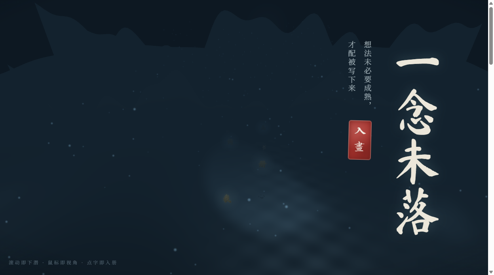
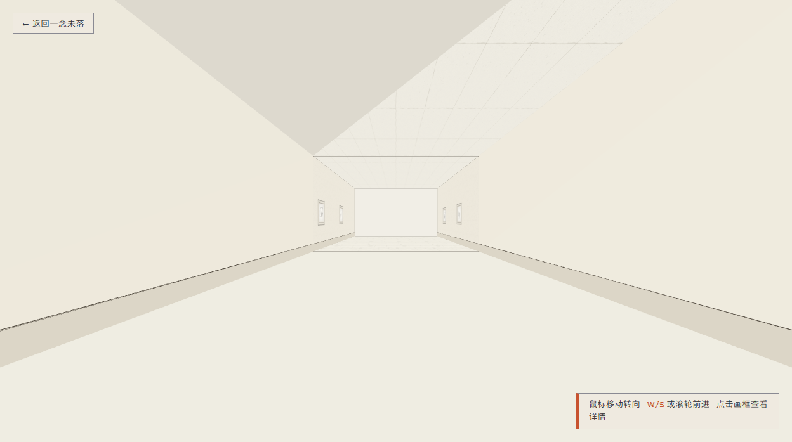
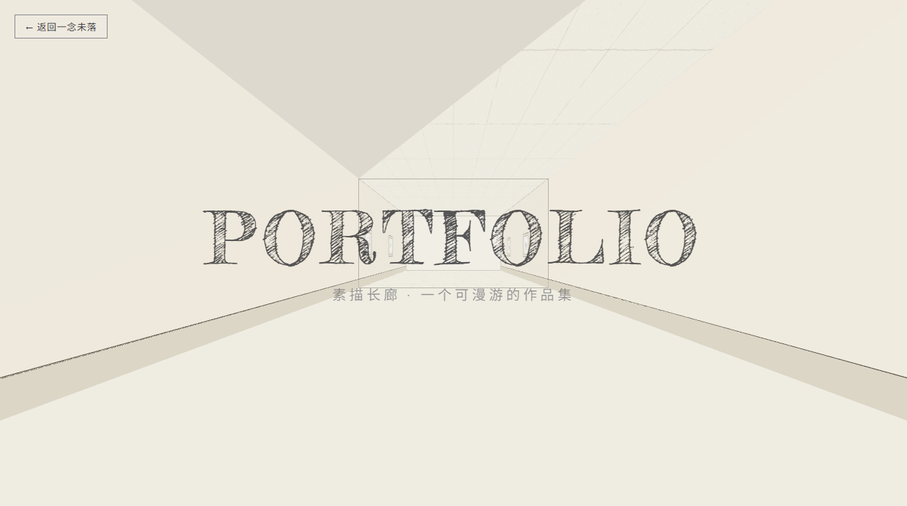

# 从零做出这两个页面 —— 新手实操手册

> 写给"完全没做过网页"的人。
> 如果你能照着步骤点鼠标、敲字，你就能做完。

---

## 先看这个：你要做的东西长什么样

**作品 A：`index.html`（一念未落 · 落地页）**



一个深蓝夜空的水墨山水页。滚动 = 往下潜，鼠标移动 = 转头看，点鎏金字 = 跳页。

**作品 B：`portfolio-3d`（3D 素描长廊）**



一个可以走进去的走廊，墙上挂着画。鼠标控制视线，W/S 前进，鼠标放到画上它会从黑白素描变成彩色，点它弹出详情。



进场时先看到一张纸，纸中间撕开，露出后面的长廊——这是最抓人的 5 秒。

---

## 这份材料一共 6 个文件，按这个顺序看

| 顺序 | 文件 | 什么时候看 | 大概要多久 |
|---|---|---|---|
| ① | **`00-先看这个-阅读指引.md`** | 现在就看完 | 5 分钟 |
| ② | **`01-新手实操手册.md`**（本文） | 主要教材，边看边做 | 分 6 个阶段，每阶段 1~3 小时 |
| ③ | **`02-知识点总图与通俗比喻.md`** | 卡住时当字典查 | 随时翻 |
| ④ | **`03-知识点思维导图.md`** | 想快速回顾全局 | 10 分钟 |
| ⑤ | **`04-速查卡.md`** | 做的时候贴屏幕旁边 | 随时看 |
| ⑥ | **`05-学习资源地图.md`** | 想深入某个知识点 | 按需 |

**最省事的用法**：先花 5 分钟看 `00-阅读指引`，然后打开本文档，从「阶段 0」开始做。做不动了就去 `02` 查概念，或者去 `05` 找视频。

---

## 目录

- [阶段 0 · 心态与工具（30 分钟）](#阶段-0--心态与工具30-分钟)
- [阶段 1 · 网页三件套：HTML / CSS / JS（2 小时）](#阶段-1--网页三件套html--css--js2-小时)
- [阶段 2 · 做出作品 A：静态落地页（3 小时）](#阶段-2--做出作品-a静态落地页3-小时)
- [阶段 3 · 让页面动起来：Three.js 入门（3 小时）](#阶段-3--让页面动起来threejs-入门3-小时)
- [阶段 4 · 搭起工程：npm + Vite（2 小时）](#阶段-4--搭起工程npm--vite2-小时)
- [阶段 5 · 3D 长廊：React + R3F（4 小时）](#阶段-5--3d-长廊react--r3f4-小时)
- [阶段 6 · 最后的高光：GLSL 着色器（3 小时）](#阶段-6--最后的高光glsl-着色器3-小时)
- [收尾 · 两个页面怎么连起来](#收尾--两个页面怎么连起来)

---

# 阶段 0 · 心态与工具（30 分钟）

## 0.1 先说三句实话

**第一句：你会一直看到"看不懂的报错"，这是正常的。**

写代码不是"一次写对"，是"错了、改、再错、再改"。做了十年的人也一样。区别只是他见过的错比你多，改得更快。你现在的任务不是"不犯错"，是"学会看报错说的什么"。

**第二句：不需要背。**

你需要记住的只有一件事：**遇到问题去哪查**。所有语法、所有 API，都可以现查。这份手册后面会专门教你怎么查。

**第三句：不要从"看懂"开始，要从"抄对"开始。**

先照着敲一遍、让它跑起来、看到效果，再回头理解为什么。人对"我做出了一个东西"的记忆，远比对"我读懂了原理"的记忆牢固。

## 0.2 你会做出什么（先看一眼目标）

打开这两个文件夹，先看成品（现在可能还跑不起来，没关系，先看）：

```
E:\fhgBLOG\IDEAblog\               ← 作品 A：静态站点
  index.html        ← 落地页（双击就能开）
  ideas.html        ← 想法集
  about.html        ← 关于
  style.css         ← 所有样式
  assets\           ← 图片、脚本、Three.js 库

E:\fhgBLOG\IDEAblog\portfolio-3d\  ← 作品 B：3D 工程
  index.html        ← 只有几行，是个"壳"
  package.json      ← 项目清单（记着用了哪些库）
  vite.config.js    ← 构建配置
  src\              ← 你真正要写的代码都在这
```

**关键区别，先记住**：

- **作品 A** 是"三件套"写法：HTML + CSS + JS 各一个文件，浏览器直接打开就能跑。**适合入门。**
- **作品 B** 是"工程化"写法：代码被拆成很多小文件（`.jsx`），需要先"编译"才能跑。**适合做复杂项目。**

为什么作品 B 不能双击打开？因为 `.jsx` 这种文件浏览器不认识，必须先用工具翻译成浏览器能懂的 `.js`。这个翻译工具叫 **Vite**。

## 0.3 装工具（15 分钟）

你只需要装 **2 个**东西。

### 工具 1：VS Code（写代码的地方）

下载地址：**https://code.visualstudio.com/**

点页面中间那个大大的蓝色 `Download for Windows`。装的时候一路"下一步"就行，**两个勾都打上**（"添加到 PATH"那个务必打，不然后面命令会找不到）。

装完第一次打开，左边会有一排图标。**装一个中文包**让它变中文：

1. 点左边那个四个方块的图标（叫"扩展"）
2. 搜索框里打 `chinese`
3. 找到 **Chinese (Simplified) (简体中文)**，点 `Install`
4. 右下角弹窗点 `Restart`，重启后就是中文了

### 工具 2：Node.js（让你能跑工程化项目）

下载地址：**https://nodejs.org/zh-cn**

**一定要下左边的 `LTS` 版本**（LTS = 长期支持版，最稳），不要下右边的 Current。

装的时候同样一路下一步，**全部默认**。

### 怎么验证装好了

按键盘 `Win + R`，输入 `cmd`，回车。会弹出一个黑框（这个叫"命令行"，后面会经常用）。

在黑框里敲下面这行，然后回车：

```
node -v
```

**如果显示 `v20.x.x` 或 `v22.x.x` 这样的版本号 —— 成功了。**

再敲一行：

```
npm -v
```

同样应该显示版本号。

> **如果显示"不是内部或外部命令"** —— 说明装的时候没勾"添加到 PATH"。最简单的办法：卸载 Node.js，重新装一遍，这次注意勾上。或者直接重启电脑再试。

## 0.4 认识命令行（5 分钟，很重要）

你会一直用到这三个命令，**死记也行**：

| 命令 | 什么意思 | 什么时候用 |
|---|---|---|
| `cd 路径` | 进入某个文件夹（change directory） | 每次开新的黑框，先 `cd` 到项目文件夹 |
| `dir` | 列出当前文件夹里有什么 | 想确认自己在哪、文件在不在 |
| `npm install` | 下载项目需要的所有库 | 第一次打开别人的项目时 |

**例如**，要进入作品 B 的文件夹：

```
cd /d E:\fhgBLOG\IDEAblog\portfolio-3d
```

> ⚠️ 注意那个 `/d`。**如果要从 C 盘跳到 E 盘，必须加 `/d`**，否则 `cd` 只会在当前盘里转圈。这是新手最常见的卡点之一。

**怎么确认自己进去了**？看黑框里光标前面那截，会变成 `E:\fhgBLOG\IDEAblog\portfolio-3d>`。或者敲 `dir`，看列出来的文件对不对。

## 0.5 一个救命技能：F12

打开任意网页（就用你现在的浏览器），按键盘 **`F12`**。

会弹出一个面板。这个东西叫"开发者工具"，是你以后 90% 的时间用来找问题的地方。

它有几个标签页，先把这 3 个认住：

| 标签 | 中文 | 干什么的 | 什么时候看 |
|---|---|---|---|
| **Console** | 控制台 | 显示报错和 `console.log` 输出 | **永远先看这个** |
| **Elements** | 元素 | 看页面的 HTML 结构、改样式试效果 | 想调颜色/间距时 |
| **Network** | 网络 | 看每个文件加载成功没（状态码） | 图片不显示、字体不对时 |

**最重要的一条经验**：页面出问题，**第一件事永远是打开 Console 看红色报错**。

红色报错会告诉你「第几个文件的第几行、出了什么错」。翻译成人话就是"病灶位置 + 症状"，比任何猜测都准。

> **比喻**：Console 就是医院的检验报告。你不会拿着报告自己开刀，但你会看它指着哪儿。看不懂没关系，把红字复制去搜。

## 0.6 阶段 0 检查表

做完这些再往下走：

- [ ] VS Code 装好了，并且是中文界面
- [ ] `node -v` 能显示版本号
- [ ] `npm -v` 能显示版本号
- [ ] 会 `cd /d 路径` 进入一个文件夹
- [ ] 知道按 `F12` 打开开发者工具，知道 Console 在哪

**都打勾了就继续。有一项没成，先解决它——后面每一步都依赖这个。**

---

# 阶段 1 · 网页三件套：HTML / CSS / JS（2 小时）

## 1.1 一句话理解这三个东西

| 技术 | 干什么的 | 生活比喻 |
|---|---|---|
| **HTML** | 决定**有什么**（标题、段落、图片、按钮） | 房子的**毛坯墙**——哪是卧室哪是厨房 |
| **CSS** | 决定**长什么样**（颜色、大小、位置） | **装修**——刷什么墙漆、家具摆哪 |
| **JavaScript** | 决定**会做什么**（点击、动画、算数） | **水电煤气**——一按开关灯就亮 |

三个都要写，缺一不可。但它们的关系是分层的：HTML 是骨架 → CSS 是皮肤 → JS 是神经。

## 1.2 动手：15 分钟做出你的第一个网页

1. 在桌面新建一个文件夹，叫 `我的第一个网页`
2. 打开 VS Code → 菜单"文件"→"打开文件夹"→ 选中它
3. 左边文件区右键 → "新建文件"→ 命名 `index.html`（**注意后缀必须是 .html**）
4. 把下面整段**原样敲进去**（敲比复制好，手会记住）：

```html
<!DOCTYPE html>
<html lang="zh-CN">
<head>
  <meta charset="UTF-8">
  <title>我的第一个网页</title>
</head>
<body>
  <h1>你好，世界</h1>
  <p>这是我写的第一段话。</p>
  <button id="btn">点我</button>
  <p id="result"></p>
</body>
</html>
```

5. 保存（`Ctrl + S`）→ 在文件夹里**双击 `index.html`** → 浏览器打开了。

**你现在已经会做网页了。** 真的，剩下的一切都是在这个基础上加东西。

### 逐行拆解（不用背，看懂就行）

| 这行 | 什么意思 |
|---|---|
| `<!DOCTYPE html>` | 声明"我是 HTML5 网页"。固定写法。 |
| `<html lang="zh-CN">` | 整个网页的开始，`lang` 说这是中文 |
| `<head>...</head>` | **给浏览器看**的信息（标题、字符编码），不显示在页面上 |
| `<meta charset="UTF-8">` | 用 UTF-8 编码。**不写会乱码**——中文变"锟斤拷"就是这个原因 |
| `<title>` | 浏览器标签页上显示的字 |
| `<body>...</body>` | **给人看**的内容，页面上显示的都在这 |
| `<h1>` | 一级标题（h1~h6，数字越小字越大） |
| `<p>` | 段落（paragraph） |
| `<button>` | 按钮 |
| `id="btn"` | **给这个按钮起个名字**，方便后面用代码找到它 |

### 核心概念：标签（tag）

HTML 的一切都是"标签"。写法长这样：

```html
<标签名 属性="值">内容</标签名>
   ↑         ↑          ↑
 开始标签   附加信息    结束标签（多个 / ）
```

**比喻**：标签就像**给文字贴的便签**。`<h1>标题</h1>` 的意思是"从 `<h1>` 到 `</h1>` 之间的字，都是标题"。浏览器看到便签，就知道该把它显示成大号粗体。

有些标签没有内容，就自己闭合：

```html

<br>
```

## 1.3 加上 CSS：让页面好看

现在页面是"毛坯"——黑字白底，丑。给它装修。

**改法**：在 `<head>` 里面加一段 `<style>`：

```html
<head>
  <meta charset="UTF-8">
  <title>我的第一个网页</title>
  <style>
    body {
      background: #f4f1e8;      /* 背景：米白宣纸色 */
      font-family: "KaiTi", serif;
      text-align: center;
      padding-top: 80px;
    }
    h1 {
      color: #1c1a17;           /* 焦墨色 */
      font-size: 48px;
      letter-spacing: 8px;      /* 字间距 */
    }
    p {
      color: #4a4640;
      font-size: 18px;
    }
    button {
      background: #a8322d;      /* 朱砂色 */
      color: #f4f1e8;
      border: none;
      padding: 10px 28px;
      font-size: 16px;
      cursor: pointer;          /* 鼠标移上去变小手 */
      border-radius: 4px;
    }
  </style>
</head>
```

保存 → 刷新浏览器。**页面完全变了。**

### CSS 的核心概念：选择器 + 属性

```css
选择器 {
  属性名: 值;
}
```

| 选择器写法 | 选中什么 | 例子 |
|---|---|---|
| `body` | 所有 `<body>` 标签 | 管全页 |
| `h1` | 所有 `<h1>` 标签 | 管所有大标题 |
| `.card` | **class 叫 card** 的所有元素 | 管一堆同类的东西 |
| `#btn` | **id 叫 btn** 的那一个元素 | 管一个特定的 |

> **`.点` 和 `#井号` 的区别**：`#id` 是**身份证**（一页只能一个），`.class` 是**工牌**（可以很多人戴同一个）。

### 必须认识的 3 个属性

```css
.box {
  color: red;              /* 文字颜色 */
  background: black;       /* 背景色 */
  font-size: 20px;         /* 字号 */
  width: 300px;            /* 宽 */
  height: 100px;           /* 高 */
  margin: 20px;            /* 外边距：和别人的距离 */
  padding: 20px;           /* 内边距：内容和边框的距离 */
  border: 1px solid #ccc;  /* 边框：粗细 样式 颜色 */
  border-radius: 8px;      /* 圆角 */
}
```

**`margin` 和 `padding` 的区别，一个比喻讲清**：

想象一个快递盒。

- **`padding`** = 盒子里**泡泡纸的厚度**（内容离盒壁的距离）
- **`border`** = **盒子本身**的纸板
- **`margin`** = 这个盒子**和旁边盒子之间留的空隙**

## 1.4 加上 JavaScript：让页面会动

现在页面好看了但死的。让按钮能点。

**改法**：在 `</body>` **前面**加一段 `<script>`：

```html
  <script>
    // 1. 找到那个按钮
    var btn = document.getElementById("btn");
    var result = document.getElementById("result");
    var count = 0;

    // 2. 告诉它：被点击时该干什么
    btn.onclick = function () {
      count = count + 1;
      result.textContent = "你点了 " + count + " 次";
    };
  </script>
```

保存 → 刷新 → 点按钮。**数字会涨。**

### JS 的核心概念

| 概念 | 写法 | 比喻 |
|---|---|---|
| **变量** | `var count = 0` | 一个**带标签的盒子**，往里放东西 |
| **函数** | `function () { ... }` | 一个**菜谱**——写好放着，需要时才做 |
| **事件** | `btn.onclick = ...` | **门铃**——有人按就执行 |
| **取值/赋值** | `result.textContent = "..."` | 往盒子里**放**东西 / **拿**东西 |

**最重要的一行代码**：

```js
document.getElementById("btn")
```

翻译：**从文档（document）里，按 id 找到（getElementById）那个叫 "btn" 的东西**。

这一行是 JS 和 HTML 之间的桥。你先在 HTML 里给元素起 `id`，再用这一行在 JS 里抓住它，然后就能任意操作它了。

### 调试：`console.log`

在 JS 里写：

```js
console.log("我走到这了", count);
```

按 `F12` 打开 Console，你会看到输出。**这是你以后最常用的排查手段**——不确定变量是什么值、不确定代码执行到没有，就 `console.log` 一下。

**比喻**：`console.log` 就像在代码里撒面包屑，看自己走到哪了。

## 1.5 阶段 1 练习（强烈建议做）

用刚学的东西，做一个"自我介绍卡片"：

1. 一个大标题写你的名字
2. 一段自我介绍
3. 一个按钮，点了会显示当前时间

**提示**：显示时间用 `new Date().toLocaleString()`。

做不出来也没关系，但**一定要动手试**。看十遍不如敲一遍。

## 1.6 阶段 1 检查表

- [ ] 手敲出过一个能打开的 `index.html`
- [ ] 知道 `<head>` 和 `<body>` 的区别
- [ ] 会用 CSS 改背景色和字号
- [ ] 会用 `getElementById` 抓元素
- [ ] 会用 `console.log` 在 Console 里打印东西
- [ ] F12 能打开，知道 Console 在哪

**继续往下前，请务必完成练习。** 阶段 2 会用到全部这些。

---

# 阶段 2 · 做出作品 A：静态落地页（3 小时）

现在做一个真的东西。目标：`E:\fhgBLOG\IDEAblog\index.html` 这个"一念未落"落地页。

## 2.1 先拆解：这个页面由什么组成

用 F12 看一下真实的 `index.html`，结构是这样的：

```
<body>
  <header>                     ← 顶栏
    <a class="idea-brand">一念未落</a>    ← 站名
    <nav class="idea-nav">              ← 导航
      <a>首页</a> <a>想法集</a> <a>关于</a> <a>3D 长廊</a>
    </nav>
  </header>

  <main>
    <canvas id="idea-gl"></canvas>       ← 3D 画面（阶段 3 才做）
    <div class="idea-titleblock">        ← 竖排标题
      <h1 class="idea-vtitle">一念未落</h1>
    </div>
    <div class="idea-dive-end">          ← 下潜终点的入口按钮
      <a href="...">落笔入册 · 进入 3D 长廊</a>
    </div>
  </main>

  <script src="assets/vendor/three.min.js"></script>
  <script src="assets/ink-world.js"></script>
</body>
```

**关键洞察**：一个网页看着复杂，拆开就是**几个大块**。每个大块里再放小东西。这就是"布局思维"。

## 2.2 第一步：搭 HTML 骨架

新建 `index.html`，写骨架（先不管样式和 3D）：

```html
<!DOCTYPE html>
<html lang="zh-CN">
<head>
  <meta charset="UTF-8">
  <meta name="viewport" content="width=device-width, initial-scale=1.0">
  <title>一念未落 · 想法集</title>
  <link rel="stylesheet" href="style.css">
</head>
<body class="idea-page">

  <header class="idea-head">
    <a class="idea-brand" href="index.html">一念未落</a>
    <nav class="idea-nav">
      <a href="index.html">首页</a>
      <a href="ideas.html">想法集</a>
      <a href="about.html">关于</a>
      <a href="http://localhost:5173" target="_blank" rel="noopener">3D 长廊</a>
    </nav>
  </header>

  <main class="idea-hero">
    <div class="idea-titleblock">
      <h1 class="idea-vtitle">
        <span>一</span><span>念</span><span>未</span><span>落</span>
      </h1>
      <p class="idea-vsub">想法未必要成熟，才配被写下来</p>
    </div>
  </main>

</body>
</html>
```

### 新东西解释

| 这行 | 干什么的 |
|---|---|
| `<meta name="viewport" ...>` | **手机适配必写**。不写的话手机打开会缩得很小 |
| `<link rel="stylesheet" href="style.css">` | 引入外部 CSS 文件（比写在 `<style>` 里更整洁） |
| `class="idea-head"` | 给元素起 class，CSS 里用 `.idea-head` 选中 |
| `<span>一</span><span>念</span>` | 把每个字单独包起来——**这样才能一个字一个字单独控制**（比如竖排、单独动画） |
| `target="_blank"` | 在新标签页打开 |
| `rel="noopener"` | 安全习惯。陪着 `target="_blank"` 写就对了 |

## 2.3 第二步：写 CSS

新建 `style.css`，开始装修。**先定全局变量**，这是好习惯：

```css
:root {
  /* 颜色 */
  --xuan: #f4f1e8;        /* 宣纸米白 */
  --xuan-deep: #eae5d8;   /* 宣纸暗部 */
  --mo: #1c1a17;          /* 焦墨 */
  --mo-mid: #4a4640;      /* 重墨 */
  --zhu: #a8322d;         /* 朱砂（只用在印章和强调） */

  /* 字体 */
  --font-brush: "Ma Shan Zheng", "STKaiti", "KaiTi", serif;
  --font-serif: "Noto Serif SC", "STSong", "SimSun", serif;
}
```

**为什么要 `:root` 变量？**

好处是**改一个地方，全站跟着变**。想换主色调，只改 `--zhu` 一行就够了，不用在几百行 CSS 里找 `#a8322d`。

> **比喻**：`--zhu: #a8322d` 就像给这个颜色起了个外号"朱砂"。以后所有地方说"要朱砂色"，就写 `var(--zhu)`。哪天你觉得该换成更深的红，只改外号的定义，所有引用处自动更新。

**用法**：

```css
.idea-brand {
  color: var(--zhu);     /* 用 var() 取值 */
}
```

接着写布局：

```css
body.idea-page {
  margin: 0;                              /* 去掉浏览器默认边距 */
  background-color: var(--xuan);
  color: var(--mo);
  font-family: var(--font-serif);
  font-size: 17px;
  line-height: 1.9;                       /* 行高：中文排版 1.8~2.0 好看 */
  -webkit-font-smoothing: antialiased;    /* 字体渲染更细腻，固定写法 */
  overflow-x: hidden;                     /* 别出现横向滚动条 */
}

/* 顶栏：左右两端对齐 */
.idea-head {
  display: flex;                  /* 开启弹性布局 */
  justify-content: space-between; /* 主轴上两端分开 */
  align-items: center;            /* 交叉轴上居中 */
  padding: 20px 44px;
  border-bottom: 1px solid rgba(28, 26, 23, .08);
}

.idea-nav a {
  margin-left: 24px;
  color: var(--mo-mid);
  text-decoration: none;          /* 去掉下划线 */
  transition: color .2s;          /* 颜色变化用 0.2 秒过渡，不突兀 */
}
.idea-nav a:hover {
  color: var(--zhu);
}
```

### 最重要的一个新概念：Flexbox

`display: flex` 是**现代网页布局的核心**。记住两个属性就够用八成：

| 属性 | 值 | 效果 |
|---|---|---|
| `justify-content` | `space-between` | 两端分开（一个左一个右） |
| | `center` | 挤在中间 |
| | `flex-start` / `flex-end` | 靠左 / 靠右 |
| `align-items` | `center` | 垂直居中（**超常用**） |
| | `flex-start` / `flex-end` | 顶对齐 / 底对齐 |

> **比喻**：Flex 就像一个**会自动排位的抽屉**。你说"这些照片怎么摆"——横着排还是竖着排（`flex-direction`）、贴哪边（`justify-content`）、怎么对齐（`align-items`），抽屉自动帮你摆好。再也不用手算坐标了。

**这是一条命令：把下面这段 CSS 用 `align-items: center; justify-content: center;` 做到"完美居中"**，一定要试一次：

```css
.idea-hero {
  min-height: 100vh;        /* 100vh = 视口高度的 100% */
  display: flex;
  flex-direction: column;
  align-items: center;
  justify-content: center;
}
```

> `vh` 是个单位，`100vh` = 屏幕高度的 100%。还有 `vw` = 屏幕宽度的 100%。

## 2.4 竖排标题怎么做

中文竖排是"一念未落"这个页面的特色。注意看 HTML 是怎么写的——每个字单独一个 `<span>`。然后 CSS：

```css
.idea-vtitle {
  display: flex;
  flex-direction: column;     /* 竖着排 */
  font-family: var(--font-brush);
  font-size: 72px;
  letter-spacing: 4px;
  margin: 0;
}
```

`flex-direction: column` 让子元素从上往下排——于是四个 `<span>` 竖起来了。

> 这是**"拆细"思维**的典型例子：想要每字单独控制，就先在 HTML 里把它们拆开。**CSS 做不了的事，往往可以在 HTML 结构上想办法。**

## 2.5 网页字体怎么用

页面上那种毛笔字（`Ma Shan Zheng`）是从 Google Fonts 来的。用法：

在 HTML 的 `<head>` 里加：

```html
<link rel="preconnect" href="https://fonts.googleapis.com">
<link rel="preconnect" href="https://fonts.gstatic.com" crossorigin>
<link href="https://fonts.googleapis.com/css2?family=Ma+Shan+Zheng&family=Noto+Serif+SC:wght@400;600&display=swap" rel="stylesheet">
```

然后在 CSS 里：

```css
font-family: "Ma Shan Zheng", "STKaiti", "KaiTi", serif;
```

**注意那个逗号列表**——这叫"字体回退链"：

> **比喻**：字体列表就像**备胎**。浏览器从左往右试：有 `Ma Shan Zheng` 就用它；没有就试 `STKaiti`；再没有试 `KaiTi`（楷体，Windows 自带）；都没有就用系统默认的 `serif`（衬线体）。**最后一定要放一个通用字体兜底**，否则可能变成最丑的默认字体。

⚠️ **注意**：Google Fonts 在国内可能加载不了。这时会走回退链，用楷体，效果也还行。

## 2.6 一个真实踩过的坑：`position: fixed`

这个坑在真实项目里踩过两次，值得单独讲。

`position: fixed` 让元素**固定在屏幕上**，不随滚动移动。比如"返回首页"按钮就固定左上角：

```css
.back-home {
  position: fixed;
  top: 20px;
  left: 20px;
  z-index: 10;
}
```

**坑在哪？** 如果你**同时**写了 `top` 和 `bottom`：

```css
.back-home {
  position: fixed;
  top: 20px;
  bottom: 20px;      /* ← 灾难 */
  /* 没写 height */
}
```

元素会**从 top 20px 一直拉到底部 20px，纵向铺满整个屏幕**，把你整个页面糊住。

**为什么？** fixed 元素的宽高默认是"自动"——浏览器会看 `top` 和 `bottom` 都给了值，就把这个元素**拉伸填满这两条边之间的空间**。换句话说：`top` + `bottom` 相当于在说"上边距 20，下边距 20"，那中间的自然就全归你了。

**正确做法**：

```css
.back-home {
  position: fixed;
  top: 20px;         /* 只给 top */
  left: 20px;
  height: auto;      /* 显式声明高度自动（防御性写法） */
}
```

真实项目里的注释是这么写的：

```css
/* ⚠️ 与 .boot-badge 同理：position:fixed 时**不要**同时给 top 和 bottom，
   并且显式写 height:auto，否则一旦有别的规则给出高度，元素会纵向铺满视口。 */
```

**这个坑的教训**：CSS 里有大量这种"两个属性碰在一起就出怪事"的情况。所以**遇到诡异现象，先怀疑是不是属性打架了**。

## 2.7 阶段 2 检查表

- [ ] 手敲出了一个带顶栏、标题的页面
- [ ] 知道 `:root` 变量怎么定义和使用
- [ ] 会用 `display: flex` + `justify-content` + `align-items` 做布局
- [ ] 知道 `margin` / `padding` / `border` 的区别
- [ ] 会用 `position: fixed` 把东西固定在屏幕上
- [ ] 知道 `top` + `bottom` 同时写会拉伸铺满这个坑

**到这里，作品 A 的静态部分你已经会了。** 阶段 3 让它动起来。

---

# 阶段 3 · 让页面动起来：Three.js 入门（3 小时）

## 3.1 先说清楚：Three.js 是什么

Three.js 是一个**在网页里画 3D 的库**。

你已经会做 2D 网页了（文字、方块、颜色）。但要做"能走进去的走廊"这种，2D 不够用——你需要真正的 3D 空间。

自己用最底层的 WebGL 写 3D 非常难（涉及矩阵运算、着色器、显存管理）。Three.js 把这些都包好了，你只要描述"场景里有什么"，它就帮你画出来。

## 3.2 核心概念：拍电影的比喻

**这一节是整份手册最重要的部分之一，请慢读。**

Three.js 的一切都可以用**拍电影**来理解：

| Three.js 里的东西 | 电影里的对应 | 干什么的 |
|---|---|---|
| **Scene（场景）** | 片场 | 存放所有东西的地方 |
| **Camera（相机）** | 摄影机 | 决定"从哪个角度看" |
| **Mesh（网格）** | 演员 | 场景里能被看见的具体物体 |
| **Geometry（几何体）** | 演员的身材 | 形状（球？方块？平面？） |
| **Material（材质）** | 演员的衣服/皮肤 | 表面长什么样（颜色、纹理、反光） |
| **Light（灯光）** | 灯光师 | 照亮场景，决定明暗 |
| **Renderer（渲染器）** | 摄影师 | 把上面这一切"拍"成一张图显示到屏幕上 |

于是"做一个 3D 场景"就是：

> **搭好片场 → 摆好演员（给他身材和衣服）→ 架好摄影机 → 打光 → 让摄影师开拍。**

而且"开拍"不是拍一张，是**每秒拍 60 张**（这叫"帧"）。每拍一张就叫一次 `requestAnimationFrame`——这也解释了为什么叫"帧率"（FPS，Frames Per Second）。

## 3.3 最小可运行例子

新建一个文件试试。（先用最简单的方式：直接 `<script>` 引入 Three.js。）

```html
<!DOCTYPE html>
<html lang="zh-CN">
<head>
  <meta charset="UTF-8">
  <title>Three.js 最小例子</title>
  <style>
    body { margin: 0; overflow: hidden; }   /* 去掉边距，别出滚动条 */
    canvas { display: block; }              /* canvas 默认是行内元素，会多出缝隙 */
  </style>
</head>
<body>
  <script src="https://unpkg.com/three@0.160.0/build/three.min.js"></script>
  <script>
    // ① 片场
    var scene = new THREE.Scene();

    // ② 摄影机：视角 75 度，画面比例，近裁剪面，远裁剪面
    var camera = new THREE.PerspectiveCamera(
      75,                                        // fov：视野角度，越大看得越广
      window.innerWidth / window.innerHeight,    // aspect：宽高比
      0.1,                                       // near：比这近的看不到
      1000                                       // far：比这远的看不到
    );
    camera.position.z = 3;                       // 摄影机往后站 3 米

    // ③ 摄影师
    var renderer = new THREE.WebGLRenderer({ antialias: true });
    renderer.setSize(window.innerWidth, window.innerHeight);
    document.body.appendChild(renderer.domElement);   // 把画面插进页面

    // ④ 演员：身材（Geometry）+ 衣服（Material）
    var geometry = new THREE.BoxGeometry(1, 1, 1);          // 1×1×1 的方块
    var material = new THREE.MeshBasicMaterial({ color: 0xa8322d });
    var cube = new THREE.Mesh(geometry, material);
    scene.add(cube);                                        // 上场

    // ⑤ 每帧都拍一次
    function animate() {
      requestAnimationFrame(animate);       // 预约下一帧
      cube.rotation.x += 0.01;              // 转一点点
      cube.rotation.y += 0.01;
      renderer.render(scene, camera);       // 拍！显示到屏幕
    }
    animate();
  </script>
</body>
</html>
```

双击打开。**你会看到一个旋转的红色方块。**

### 逐行理解

| 代码 | 意思 |
|---|---|
| `new THREE.Scene()` | 建一个片场 |
| `new THREE.PerspectiveCamera(75, 比例, 0.1, 1000)` | 建一台透视摄影机。`75` 是视野角度，就像人的视野范围 |
| `camera.position.z = 3` | 把摄影机往后挪 3 米（不然贴脸了啥也看不见） |
| `new THREE.WebGLRenderer()` | 建摄影师。`antialias: true` = 抗锯齿，边缘更平滑 |
| `renderer.domElement` | 摄影师"拍东西的那块布"——其实就是一个 `<canvas>` 元素 |
| `new THREE.BoxGeometry(1,1,1)` | 一个 1×1×1 的方块身材 |
| `new THREE.MeshBasicMaterial({ color: ... })` | 一件红色的衣服。`0xa8322d` 是十六进制颜色 |
| `new THREE.Mesh(geometry, material)` | **把身材和衣服合成一个完整的演员** |
| `scene.add(cube)` | 让他上场 |
| `requestAnimationFrame(animate)` | **预约下一帧再叫我**——这一行造成了"无限循环" |
| `cube.rotation.x += 0.01` | 绕 X 轴每帧转 0.01 弧度 |

### 那个 `requestAnimationFrame` 是怎么回事

这是 3D 动画的**心脏**。它的逻辑很妙：

```
我要画这一帧
  ↓
画完了，但我还没要求下一帧 —— 死掉了？
  ↓
不对，我在这帧的最后，又预约了「下一帧再叫我」
  ↓
于是它永远在自我预约，形成循环
```

**比喻**：不是"我要跑 60 次"，而是"我跑一次，然后在终点再约下一次"。这样浏览器能在两次之间做别的事（比如响应你的鼠标），不会卡死。

**和 `setInterval` 的区别**：`requestAnimationFrame` 会跟着屏幕刷新率走（60Hz 屏就 60 次/秒），且**切到别的标签页时会自动暂停**，省电。**做动画永远优先用它。**

## 3.4 必须掌握的一个概念：坐标

3D 空间里的一切都用 `(x, y, z)` 三个数定位：

```
       y ↑
         |
         |
         +------→ x
        /
       ↙
      z  （朝屏幕外，也就是朝观众）
```

| 轴 | 方向 | 记忆 |
|---|---|---|
| **x** | 左(-) ← → 右(+) | 水平 |
| **y** | 下(-) ← → 上(+) | 垂直 |
| **z** | 远(-) ← → 近(+) | **朝向观众** |

⚠️ **注意 z 的方向容易搞错**：默认情况下，z 越大越靠近你。但相机在 `z = 3` 看向原点 `(0,0,0)` 时，"相机前方"是 z 减小的方向。

所以走廊往深处延伸，是 **z 越来越小**（负数方向）。这也是为什么 `useInfiniteCamera` 里写的是：

```js
camera.position.z -= speed * delta;   // 前进 = z 减小
```

## 3.5 走廊是怎么搭的

现在理解作品 B 的场景就简单了。看 `src/components/CorridorSegment.jsx` 的思路：

一个走廊段落 = **几块长方形拼出来的**：

```
       天花板（一块长方形平放）
         ═══════════════════════
        ║                     ║
  左墙  ║                     ║  右墙
        ║                     ║
         ═══════════════════════
              地板（一块长方形）
```

在 Three.js 里，"一块长方形"就是 `PlaneGeometry`（平面几何体）：

```js
new THREE.PlaneGeometry(20, 5.2)    // 20 宽、5.2 高的平面
```

然后**旋转它、摆到不同位置**，就拼成了走廊：

```js
// 地板：转 -90 度让它躺平
floor.rotation.x = -Math.PI / 2;
floor.position.y = 0;

// 天花板：转 90 度
ceiling.rotation.x = Math.PI / 2;
ceiling.position.y = 5.2;

// 左墙：转 90 度让它立起来，摆到 x = -9 的位置
leftWall.rotation.y = Math.PI / 2;
leftWall.position.x = -9;

// 右墙
rightWall.rotation.y = -Math.PI / 2;
rightWall.position.x = 9;
```

> **`Math.PI` 是什么**？π ≈ 3.14159。在 3D 里旋转用"弧度"而不是"角度"。`Math.PI` 弧度 = 180 度，`Math.PI / 2` = 90 度。
>
> **为什么不用角度**？因为数学上弧度更自然（弧长 = 半径 × 弧度）。习惯就好，记住 `Math.PI` = 180° 就行。

## 3.6 为什么长廊走不完：无限走廊的思路

真实的走廊只有一段，走到底就没了。作品 B 的走廊是"无限"的。

思路叫**分段循环**：

```
想象地上有一条传送带，上面摆着一节一节的车厢。
你往前走，最前面的一节走到你身后了，就把它拿起来，
接到队尾去。于是你永远走不到头。
```

代码里对应 `InfiniteCorridor.jsx`：维护若干个走廊段落，当某一段跑到相机后面，就把它挪到最前面。

```
相机在这里 ↓
[段1][段2][段3][段4][段5]
                    ↑ 走过头了，把它挪到最前面
[段5'][段1][段2][段3][段4]
```

这是游戏开发里的经典技巧，也叫"对象池"（object pool）——**不新建对象，只复用**。这样不会因为走得越远、对象越多而卡顿。

## 3.7 阶段 3 检查表

- [ ] 跑起来过那个旋转的红色方块
- [ ] 能说出 Scene / Camera / Mesh / Renderer 各是什么（用拍电影的比喻）
- [ ] 知道 `requestAnimationFrame` 为什么能形成循环
- [ ] 知道 3D 坐标的 x / y / z 各指向哪
- [ ] 知道 `Math.PI / 2` = 90 度
- [ ] 理解"无限走廊"的分段循环思路

---

# 阶段 4 · 搭起工程：npm + Vite（2 小时）

## 4.1 为什么需要"工程化"

到了阶段 3 你可能会想：为什么不继续用 `<script>` 引入 Three.js 那样写？

**因为项目大了就撑不住**：

| 问题 | 例子 |
|---|---|
| 所有代码挤在一个文件 | `ink-world.js` 已经 622 行，再写就疯了 |
| 没有代码提示 | 打 `THREE.` 后面不提示有什么方法 |
| 引用的库多了会乱 | 手工管 `<script>` 顺序，容易出错 |
| 性能没法优化 | 加载慢、代码不压缩 |
| 不能写"模块" | 无法把函数分到不同文件互相引用 |

**工程化的工具（Vite）解决的就是这些。**

## 4.2 npm 是什么

**npm = Node Package Manager（Node 包管理器）**。

它的作用是：**帮你下载别人写好的代码库**。

> **比喻**：npm 就像手机的应用商店。你想用 Three.js，不用自己去官网下载 JS 文件、自己管版本，只要说一句"我要 three 这个包"，它就自动下好、放好、记在案。

**一句话命令**：

```
npm install three
```

这一句会做三件事：
1. 从网上把 `three` 下载到 `node_modules/` 文件夹
2. 在 `package.json` 里记一笔"我用了 three"
3. 生成/更新 `package-lock.json`（精确记录每个包的版本，保证别人装的和你一样）

## 4.3 `package.json` 长什么样

这是项目的"身份证 + 购物清单"。看作品 B 的：

```json
{
  "name": "portfolio-3d",
  "private": true,
  "type": "module",
  "scripts": {
    "dev": "vite",
    "build": "vite build",
    "preview": "vite preview"
  },
  "dependencies": {
    "@react-three/drei": "^10.7.7",
    "@react-three/fiber": "^9.4.2",
    "gsap": "^3.14.2",
    "react": "^19.1.1",
    "react-dom": "^19.1.1",
    "three": "^0.182.0"
  },
  "devDependencies": {
    "@vitejs/plugin-react": "^5.1.0",
    "sass": "^1.94.0",
    "vite": "^7.3.6"
  }
}
```

| 字段 | 意思 |
|---|---|
| `name` | 项目名 |
| `scripts` | **自定义命令**。写了 `"dev": "vite"` 之后，就能敲 `npm run dev` |
| `dependencies` | 运行时需要的库（我的页面真正用到的） |
| `devDependencies` | 只管开发时用的（打包、编译工具，上线时不需要） |
| `^9.4.2` | 版本号规则。`^` 表示"这个主版本内的最新版都行" |

⚠️ **`node_modules` 文件夹不要拷贝、不要提交到 Git**。它动辄几百 MB，而且只要有 `package.json`，一句 `npm install` 就能重新生成。

## 4.4 Vite 是什么

**Vite（读作"维特"，法语"快"的意思）** 是一个**开发服务器 + 打包工具**。

它做两件事：

### 事情一：开发时当"翻译官 + 服务器"

你的代码里写的是 `.jsx`、`.scss` 这些浏览器**不认识**的东西。Vite 在你打开页面时**实时翻译**成浏览器能懂的 `.js` / `.css`。

而且它有个绝活叫 **HMR（热模块替换）**：

> 你改了代码 → 保存 → **不用刷新页面**，改动立刻出现在屏幕上。
>
> 更妙的是：页面状态**不会丢**。比如你在第 3 个画廊位置，改了颜色保存，你还在第 3 个画廊位置——只是颜色变了。

这个体验一旦用过就回不去了。

### 事情二：上线时"打包"

开发时是几十上百个小文件，浏览器要发几十个请求，慢。打包（`npm run build`）会把它们**合并、压缩**成少数几个文件，加载快得多。

## 4.5 从零建一个 Vite + React 工程

**这是最正规的起手式，务必亲手做一次。**

打开命令行：

```
cd /d E:\
npm create vite@latest 我的练习项目 -- --template react
```

> ⚠️ 注意 `--` 前后有空格，不能少。这是 npm 的语法要求（告诉 npm"后面这些参数是给 vite 的，不是给你的"）。

它会问你一些问题，第一次可能还会让你装 `create-vite`，输入 `y` 回车。然后：

```
cd 我的练习项目
npm install
npm run dev
```

**最后一行会输出这样一段**：

```
  VITE v7.3.6  ready in 412 ms

  ➜  Local:   http://localhost:5173/
  ➜  Network: use --host to expose
  ➜  press h + enter to show help
```

按住 `Ctrl` 点那个 `http://localhost:5173/`，浏览器就打开了。**你会看到一个默认的 Vite + React 欢迎页。**

### `localhost:5173` 是什么意思

- `localhost` = 本机（你自己的电脑）
- `5173` = 端口号（一栋楼里的房间号）

> **比喻**：`localhost` 是"这栋楼"，`5173` 是"3 楼 5173 房"。你的电脑上可以同时跑很多服务（网站、数据库、聊天软件），靠端口号区分谁是谁。

**这个开发服务器会一直开着**。命令行窗口是它的"电源"——**关掉窗口，服务就停了**，页面也就打不开了。

## 4.6 Vite 的配置文件

看作品 B 的 `vite.config.js`：

```js
import { defineConfig } from 'vite'
import react from '@vitejs/plugin-react'

export default defineConfig({
  plugins: [react()],

  // 让 Vite 认识 .glsl 文件（着色器代码），可以当模块导入
  assetsInclude: ['**/*.glsl'],

  server: {
    // index.html 里的入口链接写死了 http://localhost:5173。
    // strictPort: true 的意思是「端口被占用就直接报错，不许偷偷顺延到 5174」——
    // 否则 Vite 换了端口而链接还指着 5173，点了就是打不开，且很难想到原因。
    port: 5173,
    strictPort: true,
    open: true,          // 启动后自动打开浏览器
  },

  build: {
    target: 'es2020',
    chunkSizeWarningLimit: 1500,
  },
})
```

### 关于 `strictPort: true` —— 一个真实踩过的坑

**默认行为**：如果 5173 被占用，Vite 会**默默换成 5174** 并启动成功。

**问题**：但你的 `index.html` 里写的链接是 `http://localhost:5173`。Vite 跑在 5174，链接还指着 5173 —— **点了打不开，而且完全想不到原因**。

**解法**：`strictPort: true`。加上它之后，端口被占用就直接报错退出：

```
Port 5173 is already in use
```

**明确报错，比默默成功要好。** 这是本项目的一个设计决定，值得记住。

## 4.7 阶段 4 检查表

- [ ] 知道 `npm install` 在干什么
- [ ] 看懂 `package.json` 里的 `scripts` / `dependencies`
- [ ] 从零 `npm create vite` 建出过一个工程
- [ ] `npm run dev` 起过服务，能在浏览器看到页面
- [ ] 体验过 HMR（改代码 → 保存 → 页面自动更新、且不刷新）
- [ ] 知道 `localhost:5173` 的含义
- [ ] 知道 `strictPort` 是干什么的

---

# 阶段 5 · 3D 长廊：React + R3F（4 小时）

## 5.1 React 是什么（60 秒版）

React 是一个**帮你组织界面的库**。

**没有 React 的世界**：你要自己找元素、自己改内容、自己删元素。

```js
var el = document.getElementById("count");
el.textContent = "你点了 " + count + " 次";   // 手动找、手动改
```

**有 React 的世界**：你只描述"界面该长什么样"，改数据它自己更新。

```jsx
function Counter() {
  const [count, setCount] = useState(0)
  return <button onClick={() => setCount(count + 1)}>你点了 {count} 次</button>
}
```

**核心思想**：**界面是数据的投影**。数据变了，界面自动跟着变。你不用管怎么变，只描述该是什么样。

> **比喻**：传统做法像**手动擦黑板重写**；React 像**投影仪**——你换幻灯片（数据），画面自己变。

### 4 个必须会的概念

| 概念 | 写法 | 生活比喻 |
|---|---|---|
| **组件** | `function MyCard() { return <div/> }` | **乐高积木**——可复用的界面块 |
| **props** | `<MyCard title="你好" />` | **点菜**——从外面传进去的参数，只读 |
| **state** | `const [n, setN] = useState(0)` | **白板**——组件自己的可变数据，改了会重新渲染 |
| **副作用** | `useEffect(() => {...}, [])` | **入住/退房时要做的事**——比如挂事件监听、请求数据 |

### JSX 是什么

React 里那种"在 JS 里写 HTML"的语法叫 JSX：

```jsx
const element = <h1 className="title">你好</h1>
```

⚠️ **两个必须注意的差异**：

1. **`class` 要写成 `className`**（因为 `class` 是 JS 的保留字）
2. **标签必须闭合**：``、`<br />`

### `useState` 的关键规则

```jsx
const [count, setCount] = useState(0)
//     ↑ 读      ↑ 写        ↑ 初始值

setCount(count + 1)      // ✅ 这样改
count = count + 1        // ❌ 绝不这样改，界面不会更新！
```

**必须用 `setCount` 这个函数改，不能直接赋值。** 因为 React 要靠这个函数知道"数据变了，该重画了"。直接赋值 React 感知不到。

### `useEffect` 的关键规则：第二参数

```jsx
useEffect(() => {
  // 这里做的事
  return () => {
    // 清理（组件消失时执行）
  }
}, [依赖项])
```

| 第二个参数 | 什么时候执行 |
|---|---|
| 不写 | **每次渲染都执行**（几乎总是错的） |
| `[]` 空数组 | **只在组件第一次出现时执行一次** |
| `[count]` | count 变了就执行 |

> **`useEffect` 的比喻**：你住酒店。
> - **入住时**要做的事（挂窗帘、接 WiFi）→ `useEffect` 的函数体
> - **退房时**要做的事（关灯、还房卡）→ `return` 的那个函数
> - **`[]`** = 这房间我只入住一次，之后就住着了

**为什么这个"退房清理"很重要？** 比如你挂了个事件监听：

```jsx
useEffect(() => {
  window.addEventListener('keydown', handleKey)
  return () => window.removeEventListener('keydown', handleKey)   // ← 必须清掉
}, [])
```

不清理的话，组件消失了监听还在，**每来一个新的就多一个监听**，最后越跑越卡、行为错乱。**这个坑叫"内存泄漏"**。

## 5.2 R3F：在 React 里写 Three.js

**R3F = React Three Fiber**，是一个把 Three.js "翻译"成 React 写法的库。

**原来的 Three.js**：

```js
const geometry = new THREE.BoxGeometry(1, 1, 1)
const material = new THREE.MeshBasicMaterial({ color: 0xa8322d })
const cube = new THREE.Mesh(geometry, material)
scene.add(cube)
```

**R3F 的写法**：

```jsx
<mesh>
  <boxGeometry args={[1, 1, 1]} />
  <meshBasicMaterial color="#a8322d" />
</mesh>
```

**一眼就能看出对应关系**：

| Three.js | R3F |
|---|---|
| `new THREE.Mesh(...)` | `<mesh>` |
| `new THREE.BoxGeometry(...)` | `<boxGeometry>` |
| `new THREE.MeshBasicMaterial(...)` | `<meshBasicMaterial>` |
| `scene.add(cube)` | 写上就自动加了 |
| `color: 0xa8322d` | `color="#a8322d"` |

**命名规则**：Three.js 里的类名首字母改小写，就是 R3F 的标签名。

> **比喻**：R3F 之于 Three.js，就像**宜家的说明书**——把"一块板 + 4 个螺丝 + 6 步"这种底层操作，换成"把腿拧到桌面上"这种直观描述。

### R3F 的 `<Canvas>`

R3F 的一切都包在一个 `<Canvas>` 里：

```jsx
import { Canvas } from '@react-three/fiber'

export default function App() {
  return (
    <Canvas camera={{ fov: 62, position: [0, 1.6, 5] }}>
      <ambientLight intensity={0.8} />
      <mesh>
        <boxGeometry args={[1, 1, 1]} />
        <meshBasicMaterial color="#a8322d" />
      </mesh>
    </Canvas>
  )
}
```

`<Canvas>` 内部自动做了这些事：建 Renderer、建 Scene、建 Camera、启动渲染循环。

### `useFrame`：每帧要做的事

原版 Three.js 里你在 `animate()` 里写每帧逻辑。R3F 给你一个 hook：

```jsx
import { useFrame } from '@react-three/fiber'

function SpinningCube() {
  const ref = useRef()

  useFrame((state, delta) => {
    // delta = 距离上一帧过了多少秒
    ref.current.rotation.y += delta          // 每秒转 1 弧度
  })

  return (
    <mesh ref={ref}>
      <boxGeometry />
      <meshBasicMaterial color="#a8322d" />
    </mesh>
  )
}
```

**为什么用 `delta` 而不是写死 `+= 0.01`？**

因为写死的话，**60Hz 屏幕和 144Hz 屏幕上转的速度不一样**。用 `delta`（"过了多少秒"）就能保证不管帧率多少，**每秒转的角度都一样**。

**这是一条重要的经验：所有"随时间的运动"，都要乘 `delta`。**

## 5.3 `useRef`：抓住一个对象

```jsx
const ref = useRef()
return <mesh ref={ref} />
```

`ref` 就像一个**钩子**，挂到元素上，之后就能通过 `ref.current` 拿到这个元素本身。

> **和 `useState` 的区别**：
> - `useState` 改了会**重新渲染**（因为界面要变）
> - `useRef` 改了**不会重新渲染**（它只是存个东西，比如存 3D 对象、存定时器 id）

**在 3D 项目里 `useRef` 用得特别多**，因为你要拿到 mesh 去改它的旋转/位置。

## 5.4 项目结构怎么分

看作品 B 的 `src/` 目录：

```
src/
  main.jsx                    ← 入口，把 App 挂到页面上
  App.jsx                     ← 根组件，编排全局
  components/                 ← 界面组件
    Scene.jsx                 ← 3D 场景的总装
    InfiniteCorridor.jsx      ← 无限走廊（分段循环逻辑）
    CorridorSegment.jsx       ← 一节走廊
    PictureFrame.jsx          ← 一个画框
    PaperTearIntro.jsx        ← 开场纸张撕裂
    ArtworkDetail.jsx         ← 画作详情弹窗
  hooks/                      ← 可复用的逻辑
    useInfiniteCamera.js      ← 漫游相机
    usePaintReveal.js         ← 上色揭示
  utils/                      ← 纯工具
    sketchTextures.js         ← 生成素描纹理
    paintRevealMaterial.js    ← 上色材质
    revealRegistry.js         ← 揭示控制注册表
  constants/                  ← 常量
    artworks.js               ← 作品数据
    corridor.js               ← 走廊尺寸
  styles/                     ← 样式
```

**分文件的原则**：

| 放哪 | 放什么 | 判断标准 |
|---|---|---|
| `components/` | 有"界面"的 | 它 `return` 了 JSX |
| `hooks/` | 有"逻辑"没"界面"的 | 它用了 `useState`/`useFrame`，但没 `return` JSX |
| `utils/` | 纯函数 | 给输入就有输出，不依赖 React |
| `constants/` | 固定数据 | 写死的配置、数据表 |

**为什么要分？** 一个文件超过 300 行就该拆了。拆开之后，找东西快、改东西不容易误伤。

## 5.5 一个超级重要的坑：Context 断在 Canvas 里

这个坑项目里真的踩过，代码里还留着警告注释。

**现象**：在最外层包一个 `<InteractionProvider>`，`<Canvas>` 里的组件用 `useContext` **拿不到值**。

**原因**：R3F 的 `<Canvas>` 内部用的是**另一个 React 渲染器**（reconciler）。它会**切断外层 React 树的 context**。

**解法**：用 drei 的 `useContextBridge`：

```jsx
import { useContextBridge } from '@react-three/drei'
import { InteractionContext } from './context/InteractionContext'

function App() {
  const Bridge = useContextBridge(InteractionContext)   // ← 注意传的是 context 对象

  return (
    <InteractionProvider>
      <Canvas>
        <Bridge>
          <Scene />
        </Bridge>
      </Canvas>
    </InteractionProvider>
  )
}
```

⚠️ **常见错误**：`useContextBridge` 接收的是 **context 对象**（`InteractionContext`），**不是 Provider 组件**。这个写法错误很难自己看出来。

## 5.6 阶段 5 检查表

- [ ] 能说出组件 / props / state / 副作用的区别（乐高/点菜/白板/入住退房）
- [ ] 知道 `class` 在 JSX 里要写 `className`
- [ ] 会用 `useState`，并且知道必须用 setter 改
- [ ] 会用 `useEffect`，理解 `[]` 的意思
- [ ] 知道 `useEffect` 里为什么必须 return 清理函数
- [ ] 会用 `useRef` 抓住一个 mesh
- [ ] 知道 `useFrame` 里为什么运动要乘 `delta`
- [ ] 看懂 `<mesh>` / `<boxGeometry>` 和 `new THREE.Mesh()` 的对应
- [ ] 知道 Canvas 里 context 会断，要用 `useContextBridge`

---

# 阶段 6 · 最后的高光：GLSL 着色器（3 小时）

## 6.1 着色器是什么

前面我们用的是"现成的材质"（`meshBasicMaterial` 就是纯色）。但有些效果现成材质做不出来——比如"素描稿被笔触扫过变成彩色"。

**着色器（Shader）就是让你自己写代码决定每个像素长什么样。**

> **比喻**：现成材质像**买现成的墙纸**，只有有限的图案可选。着色器像**自己拿画笔一笔一笔画**——每个像素由你决定。

**GLSL** 是写着色器的语言（OpenGL Shading Language），长得像 C 语言。

## 6.2 两个着色器：顶点 + 片元

一个材质由两段代码组成：

| 名字 | 干什么 | 比喻 |
|---|---|---|
| **顶点着色器**（vertex） | 决定**顶点的位置** | 决定**骨架往哪摆** |
| **片元着色器**（fragment） | 决定**每个像素的颜色** | 决定**皮肤涂什么色** |

流程：

```
模型顶点 → 顶点着色器（挪位置）→ 光栅化（连成面）→ 片元着色器（涂色）→ 屏幕
```

**做视觉效果，90% 的时间在写片元着色器**（因为颜色是它决定的）。

## 6.3 GLSL 最小例子

在 ShaderToy 网站上（https://www.shadertoy.com/）可以直接玩，不用搭环境。

一段最简单的片元着色器：

```glsl
void main() {
  // gl_FragColor 是「输出」（这个像素的颜色）
  gl_FragColor = vec4(1.0, 0.0, 0.0, 1.0);   // 红, 绿, 蓝, 透明度
}
```

**整个屏幕会变红。**

### GLSL 和 JS 的几个关键差异

| 差异 | JS | GLSL |
|---|---|---|
| 小数必须带点 | `1` | **`1.0`**（写 `1` 会报错！） |
| 多分量类型 | 没有 | `vec2(x,y)` `vec3(r,g,b)` `vec4(r,g,b,a)` |
| 向量运算 | 要拆开算 | **可以整体算**：`vec3 a = b * 2.0` 会自动乘每个分量 |
| 取值 | 常见 | `v.xy` 取前两个分量，`v.rgb`、`v.xyz` 都行 |

**`vec3 a = b * 2.0` 这种"整体运算"是 GLSL 的精髓**，也是它写起来最爽的地方。

### 一个实用例子：屏幕渐变色

```glsl
// vUv 是 0~1 的坐标：左下角(0,0) 右上角(1,1)
void main() {
  float t = vUv.y;                          // 竖方向的 0~1
  gl_FragColor = vec4(t, 0.3, 1.0 - t, 1.0);
}
```

屏幕从下往上，红色从黑到亮、蓝色从亮到黑。

## 6.4 本项目的核心技巧：噪声

"素描被笔触扫过"这个效果的关键是**噪声（noise）**。

**什么是噪声？** 就是**可控的随机**。

- 纯随机：`random()` — 每个点都完全无关，看起来像电视机雪花
- **噪声**：相邻的点有相关性 — 看起来像**自然的纹理**（纸张纤维、云、水波、笔触）

> **比喻**：**纯随机像撒一把沙子**——每粒位置都无关。**噪声像揉皱的纸**——虽然不规则，但纹路是连续的、有方向的。手绘感要的是后者。

本项目的 `paintRevealMaterial.js` 里用的是一个简易 hash 噪声：

```glsl
// hash：把任意数打散成 0~1 的伪随机值
float paintHash(vec2 p) {
  return fract(sin(dot(p, vec2(127.1, 311.7))) * 43758.5453);
}

// 值噪声：在网格点上取随机值，再平滑插值
float paintNoise(vec2 p) {
  vec2 i = floor(p);
  vec2 f = fract(p);
  vec2 u = f * f * (3.0 - 2.0 * f);        // 平滑曲线，避免格子感

  float a = paintHash(i);
  float b = paintHash(i + vec2(1.0, 0.0));
  float c = paintHash(i + vec2(0.0, 1.0));
  float d = paintHash(i + vec2(1.0, 1.0));

  return mix(mix(a, b, u.x), mix(c, d, u.x), u.y);
}
```

逐段看：

| 这段 | 干什么 |
|---|---|
| `floor(p)` | 取整 → 得到**格子编号**（我落在哪个格子里） |
| `fract(p)` | 取小数 → 得到**格内位置**（0~1） |
| `f * f * (3.0 - 2.0 * f)` | **平滑曲线**。让相邻格子之间过渡自然，不然会有明显的方格 |
| `paintHash(i)` 等四个 | 取格子**四个角**的随机值 |
| `mix(a, b, u.x)` | 在 a、b 之间按 `u.x` 插值（`u.x = 0.5` 就取中间值） |
| 最后再 `mix` 一次 | 把上下两条边再插值一次 → 二维平滑噪声 |

**两层噪声叠加**是本项目的做法：

```glsl
float n = paintNoise(localPos * uScale1) * uAmp1     // 大尺度：整体笔触方向
        + paintNoise(localPos * uScale2) * uAmp2;    // 小尺度：毛边细节
```

> **为什么要两层？** 一层噪声看起来很"塑料"。**大尺度给形状，小尺度给粗糙感** —— 这是所有程序化纹理的通用套路（云、石头、木头都这么干）。

## 6.5 本项目的核心算法：用噪声"切"出一个边界

上色效果的本质是：

> **在画面上画一条会移动的边界，边界左边显示彩色图，右边显示素描图。**

关键代码（`paintRevealMaterial.js` 的片元着色器）：

```glsl
// 1. 算出当前像素在「上色方向」上走了多远
vec3 paintLocal = vPaintWorldPos - uPaintOrigin;
float paintDist = dot(paintLocal, uPaintDir);

// 2. 噪声扰动 —— 让边界不是一条直线，而是一条毛边
float paintN = paintNoise(paintLocal.yz * uPaintScale1) * uPaintAmp1
             + paintNoise(paintLocal.yz * uPaintScale2) * uPaintAmp2;

// 3. 阈值 = 进度决定的位置 + 噪声扰动
float paintThreshold = mix(-uPaintSpan, uPaintSpan, uPaintProgress) + paintN;

// 4. 判断：在边界"里面"还是"外面"
float paintToEdge = paintDist - paintThreshold;

if (paintToEdge < 0.0) {
  // 边界内侧 → 显示彩色版
  vec4 paintedColor = texture2D(uMapPainted, vMapUv);
  diffuseColor = vec4(paintedColor.rgb, diffuseColor.a * paintedColor.a);
} else if (uPaintProgress > 0.002 && uPaintProgress < 0.998) {
  // 边界附近 → 加一抹"湿墨"的暖色，让笔触有实体感
  float edgeInside = smoothstep(uPaintEdge, 0.0, paintToEdge);
  float edgeOutside = smoothstep(uPaintEdge * 4.0, 0.0, -paintToEdge);
  float edgeBand = edgeInside * (1.0 - edgeOutside);
  float revealEnvelope = 1.0 - abs(uPaintProgress * 2.0 - 1.0);
  float wet = edgeBand * revealEnvelope;
  diffuseColor.rgb += vec3(0.10, 0.07, 0.03) * wet;
}
```

### 逐段理解

| 步骤 | 代码 | 意思 |
|---|---|---|
| 1 | `dot(paintLocal, uPaintDir)` | **点积**：算出"这个像素在笔触方向上投影了多远"。这是把三维位置压成一个"进度标量" |
| 2 | `paintNoise(...) * uAmp` | 噪声扰动。**没有它边界是直的，有了它边界是毛的** |
| 3 | `mix(-span, span, progress)` | 进度 0 时阈值在起点，进度 1 时在终点。`mix` 就是线性插值 |
| 4 | `paintToEdge < 0.0` | 小于 0 说明"还没扫到"，其实是已经扫过了（取决于方向定义） |

**`smoothstep` 是什么？**

```glsl
smoothstep(edge0, edge1, x)
```

它把 `x` 从 `edge0` 到 `edge1` 的变化，映射成 **0 到 1 的平滑曲线**。

- `x <= edge0` → 返回 0
- `x >= edge1` → 返回 1
- 中间 → 平滑过渡（不是直线，是 S 形曲线）

**干嘛用的？** **避免生硬的边界**。用 `if` 判断得到的是"非黑即白"，用 `smoothstep` 得到的是"渐变"——后者看起来自然得多。

**注意 `smoothstep(edge0, edge1, x)` 里如果 `edge0 > edge1`，曲线会反过来。** 代码里 `smoothstep(uPaintEdge, 0.0, paintToEdge)` 就是这个用法——`edge0 = uPaintEdge > 0 = edge1`，于是"值越小越接近 1"。

## 6.6 本项目最惨的一个坑：反引号

**这个坑值得单独讲，因为它花了 3 小时才找到，而构建是绿的。**

### 现象

浏览器 Console 里报：

```
Uncaught ReferenceError: smoothstep is not defined
```

但 `npm run build` **完全成功，611 个模块，零警告**。

### 为什么会这样

着色器代码是通过"字符串替换"注入的。代码长这样：

```js
const fragmentShader = `
  void main() {
    // 用 smoothstep 让边界柔和
    float edge = smoothstep(0.0, uPaintEdge, paintToEdge);
  }
`
```

注意最外层的 **反引号（\`）** —— 这是 JS 的"模板字符串"，用来写多行文本。

**现在问题来了**：如果我在**注释里**又写了一个反引号：

```js
const fragmentShader = `
  void main() {
    // 这里不能写 `smoothstep(...)` 这样的代码块 ← 这个反引号会出事！
    float edge = smoothstep(0.0, uPaintEdge, paintToEdge);
  }
`
```

**第一个反引号在注释里就把字符串提前结束了！** 于是后面：

```glsl
float edge = smoothstep(0.0, uPaintEdge, paintToEdge);
```

变成了**普通的 JavaScript 代码**，在模块加载时就执行。而 JS 里没有 `smoothstep` 这个函数 —— **报错**。

### 为什么构建是绿的

因为构建时**只做打包，不执行代码**。而这个错误发生在**运行时**（模块被加载执行的那一刻）。所以 `npm run build` 高高兴兴地成功了。

**这是最危险的一类 bug：构建、类型检查全都过，但页面一打开就崩。**

### 怎么找到的

1. 构建是绿的 → 怀疑是运行时问题
2. 发现报错 `smoothstep is not defined` → 但明明写在 GLSL 里
3. **数了一遍文件里的反引号：42 个（偶数）** → 说明不是奇偶问题
4. 打印每个反引号的行号 → 发现 **第 35 和第 36 个都在第 251 行**
5. 打开第 251 行 → 就是注释里那个反引号

### 怎么预防

**规则：GLSL 注释里绝对不要写反引号。** 用什么代替？直接用引号：

```js
// ✅ 这样写安全
// 用 smoothstep 让边界柔和（参数是 0.0 / uPaintEdge / paintToEdge）

// ❌ 这样写会炸
// 用 `smoothstep(0.0, uPaintEdge, paintToEdge)` 让边界柔和
```

**还可以写个检查脚本**：扫描文件里的模板字符串，看每个模板字符串闭合之后，后面有没有裸的 GLSL 函数调用。本项目就写了这么一个脚本（`check-backticks.mjs`），并且**故意把 bug 注入到副本里验证过它真能报出来**。

> **这条经验很重要**：**写检查工具之后，一定要"故意制造错误"验证它真的能抓到。** 否则你以为你在检查，其实它什么都没查。

## 6.7 自定义材质怎么注入 Three.js

上面那些着色器代码要怎么"塞进" Three.js 的材质里？用 `onBeforeCompile`：

```js
material.onBeforeCompile = (shader) => {
  // 1. 加入自己的 uniform（可以从 JS 传值进去的变量）
  shader.uniforms.uPaintProgress = { value: 0 }
  shader.uniforms.uPaintOrigin = { value: new THREE.Vector3() }

  // 2. 在顶点着色器里插入计算
  shader.vertexShader = shader.vertexShader.replace(
    '#include <worldpos_vertex>',
    `#include <worldpos_vertex>
     vPaintWorldPos = (modelMatrix * vec4(position, 1.0)).xyz;`
  )

  // 3. 在片元着色器里插入我们的边界算法
  shader.fragmentShader = shader.fragmentShader.replace(
    '#include <dithering_fragment>',
    `#include <dithering_fragment>
     // ... 上面那一大段切边界的代码 ...
    `
  )
}
```

**`#include <xxx>` 是什么？** 那是 Three.js 内置着色器的"插槽"（官方叫 chunk）。`replace` 就是在这些插槽旁边**插队**，把自己的代码加进去。

### ⚠️ 三个必须知道的坑

**坑 1：`replace` 找不到锚点会静默失败**

`String.prototype.replace` 在找不到目标时，**原样返回字符串，不报错**。于是你的代码根本没插进去，但什么提示都没有。

**解法**：**自己检查**。

```js
const ok = shader.fragmentShader.includes('paintHash')
if (!ok) console.error('[paintReveal] 注入失败！锚点可能变了')
```

本项目的做法更细——把注入结果记到 `material.userData.paint.injection = { tried: true, ok, missing }`，然后由一个调试接口暴露出来，验证脚本就能读到。

**坑 2：材质不同但常量不同 → Three.js 会复用同一个编译结果**

Three.js 靠 `customProgramCacheKey()` 决定"这个材质要不要重新编译"。如果不实现它，**不同参数的材质会共用一个编译好的程序**，于是你改的参数根本不生效。

```js
material.customProgramCacheKey = () => {
  // 把影响编译结果的常量全编进 key 里
  return `paintReveal|${dirX.toFixed(2)}|${dirY.toFixed(2)}|${dirZ.toFixed(2)}|...`
}
```

**坑 3：`needsUpdate = true` 很贵**

改 uniform 的值很便宜（每帧改都行）：

```js
shader.uniforms.uPaintProgress.value = progress    // ✅ 便宜，每帧可做
```

`needsUpdate = true` 会触发**整个着色器重新编译**：

```js
material.needsUpdate = true                        // ❌ 昂贵！
```

**所以：动画用 uniform，只在"换了贴图"这种低频事件上用 `needsUpdate`。**

## 6.8 阶段 6 检查表

- [ ] 在 ShaderToy 上改出过颜色变化
- [ ] 知道顶点着色器和片元着色器各管什么
- [ ] 知道 GLSL 里小数必须写 `1.0` 不能写 `1`
- [ ] 理解 `vec3` 的"整体运算"
- [ ] 能说清"噪声"和"纯随机"的区别
- [ ] 知道 `smoothstep` 是干什么的
- [ ] **知道模板字符串里不能出现反引号**（这个坑一定要记住）
- [ ] 知道 `onBeforeCompile` 的 `replace` 静默失败要自己检查
- [ ] 知道 `needsUpdate` 很贵、uniform 很便宜

---

# 收尾 · 两个页面怎么连起来

## 问题的来源

你有两个东西：

| | 作品 A | 作品 B |
|---|---|---|
| 文件 | `E:\fhgBLOG\IDEAblog\index.html` | `E:\fhgBLOG\IDEAblog\portfolio-3d\` |
| 怎么打开 | **双击**就行（`file://`） | 必须先 `npm run dev`（`http://`） |

`file://` 和 `http://` 是**两种不同的协议**。浏览器不允许从一个跳到另一个时用相对路径。

## 解法：用完整绝对地址

在 `index.html` 里写链接时：

```html
<!-- ✅ 正确：写完整的 http:// 地址 -->
<a href="http://localhost:5173" target="_blank" rel="noopener">3D 长廊</a>

<!-- ❌ 错误：相对路径会被解析成 file:///E:/fhgBLOG/IDEAblog/http://... -->
<a href="localhost:5173">3D 长廊</a>
```

同样，从 3D 页面返回落地页，也要写完整的 `file://` 地址：

```jsx
<a className="back-home" href="file:///E:/fhgBLOG/IDEAblog/index.html">
  ← 返回一念未落
</a>
```

## 完整操作流程

**每次要演示时，按这个顺序：**

**第一步：起开发服务器**

打开命令行：

```
cd /d E:\fhgBLOG\IDEAblog\portfolio-3d
npm run dev
```

看到这样就成了：

```
  VITE v7.3.6  ready in 412 ms

  ➜  Local:   http://localhost:5173/
```

**⚠️ 这个窗口不要关**，关了服务就停了。

**第二步：双击打开落地页**

在文件管理器里双击 `E:\fhgBLOG\IDEAblog\index.html`。

**第三步：从落地页跳过去**

点导航栏的「3D 长廊」，或者页面往下滚到终点，点「落笔入册 · 进入 3D 长廊」。

## 为什么要用开发服务器模式，不用打包

| 模式 | 命令 | 优点 | 缺点 |
|---|---|---|---|
| **开发服务器** | `npm run dev` | **改代码立即生效**（HMR） | 得先起服务 |
| 打包 | `npm run build` | 生成静态文件，可以丢到任何服务器 | 改代码要重新打包 |

**学习阶段一定要用开发服务器模式。** 因为你总是在改代码，HMR 能让你"改一行、立刻看到"，学习效率高一个量级。

## ⚠️ 三个容易卡住的点

**问题 1：点了「3D 长廊」打不开**

**原因**：开发服务器没起，或者被关了。

**检查**：看命令行窗口还在不在。不在就重新 `npm run dev`。

---

**问题 2：命令行报 `Port 5173 is already in use`**

**原因**：之前起的服务还在跑（可能是另一个命令行窗口）。

**解法**：找到那个窗口 `Ctrl + C` 停掉；或者重启电脑。

---

**问题 3：链接里写的是 5173，但 Vite 跑在了 5174**

**原因**：没加 `strictPort`，Vite 偷偷换端口了。

**解法**：在 `vite.config.js` 里加上：

```js
server: {
  port: 5173,
  strictPort: true,   // ← 加上这个，端口被占用就直接报错，不偷偷换
}
```

---

## 最后的进阶：把 3D 也做成"双击就能开"（已实现 ✅）

**这一节原来是留给你当练习的。现在它已经做完并且验证过了，所以我把真实的
踩坑过程完整写在这里——因为它比"正确做法"更值钱。**

目标：让 `dist/index.html` **双击就能打开 3D 长廊，不需要开终端跑 `npm run dev`**。

### 先说结论：一共要过四道墙，而网上教程通常只说第一道

| 墙 | 现象 | 解决 | 常见教程是否提到 |
|---|---|---|---|
| ① 路径变成了磁盘根目录 | 白屏 + 一堆 404 | `base: './'` | ✅ 都会说 |
| ② `file://` 下 ES module / CSS 被 CORS 拦 | **还是白屏**，控制台 `net::ERR_FAILED` | 把所有资源**内联**进一个 HTML | ❌ 基本都不说 |
| ③ 字体（内联的 CSS 里 `@font-face` 失效） | 页面能开，但字体悄悄退回系统字体 | 字体也内联成 base64 | ❌ 几乎没人说 |
| ④ 图片（能显示，但 canvas 被污染） | **画面完全正常**，但 hover 上色失效 | 图片也内联成 base64 | ❌ 没人说，而且最难查 |

**只做第①步是没用的。** 这是这次踩坑最大的收获。

四道墙里，第④道最阴险 —— **它不报错、不白屏、画面看起来是对的**，
只是某个效果"好像没了"。详细经过见下面「第④道墙」那一节。

---

### 第①道墙：路径问题

Vite 默认把资源写成**绝对路径**：

```html
<script src="/assets/index-xxx.js">
```

开头的 `/` 表示"网站根目录"。用 `http://` 打开没问题，但双击本地文件
（`file://` 协议）时，它会被解析成**磁盘根目录**：

```
file:///E:/assets/index-xxx.js          ← 找这里，当然找不到
```

而文件其实在：

```
file:///E:/fhgBLOG/IDEAblog/portfolio-3d/dist/assets/index-xxx.js
```

在 `vite.config.js` 里加一行：

```js
export default defineConfig({
  base: './',        // ← 让所有资源路径变成"相对当前 HTML 文件"
  // ...
})
```

现在会输出：

```html
<script src="./assets/index-xxx.js">
```

**看起来完美，对吧？但实测：还是白屏。**

---

### 第②道墙：`file://` 下 JS 和 CSS 被 CORS 拦死 ⚠️ 最关键

这是整件事的核心。我实测拿到的浏览器报错原文：

```
Access to script at 'file:///E:/fhgBLOG/IDEAblog/portfolio-3d/dist/assets/index-xxx.js'
from origin 'null' has been blocked by CORS policy:
Cross origin requests are only supported for protocol schemes:
chrome, chrome-extension, chrome-untrusted, data, http, https, isolated-app.
net::ERR_FAILED
```

CSS 同样被拦，报错文案一样，只是把 `script` 换成 `stylesheet`。

**为什么？**

- `<script type="module">` 和 `<link rel="stylesheet">` 在 `file://` 下会被当作
  **跨域请求**处理；
- 本地文件的 Origin 是字符串 `"null"`，而白名单里只有
  `http / https / data / chrome-extension` 这些协议，`file` **不在里面**。

**关键结论：这个限制和路径写得对不对完全无关。**
哪怕你把路径写成绝对正确的 `file:///E:/...`，它照样拦。

> 这就是为什么**只加 `base: './'` 不够**。网上很多教程说"加 `base:
> './'` 就能双击打开"，那是针对**老式纯 JS 脚本**（`<script src>` 不带
> `type="module"`）说的，对 Vite 项目不成立——Vite 输出的 DOM 里默认就是
> `type="module"`。

### 解决：把所有资源**内联**进一个 HTML

没有外部请求 → 就没有跨域可拦。

```bash
npm install -D vite-plugin-singlefile
```

```js
// vite.config.js
import { viteSingleFile } from 'vite-plugin-singlefile'

export default defineConfig({
  plugins: [
    react(),
    viteSingleFile({ removeViteModuleLoader: true }),
  ],
  base: './',
  build: {
    cssCodeSplit: false,               // 别拆 CSS，拆了就是多个文件
    rollupOptions: {
      output: { inlineDynamicImports: true },   // 强制所有代码进一个 chunk
    },
  },
})
```

再 `npm run build`，输出变成：

```
dist/index.html  1,950.75 kB   ← 只有一个文件！（gzip 后 894 kB）
```

**到这里，白屏问题真的解决了。**

---

### 第③道墙：字体悄悄地失效了（最隐蔽的一坑）

第②道墙解决后，页面能开了、3D 也能走了。但我在验证时多问了一句
"字体真的加载了吗"，结果发现：

```
Cabin Sketch:loaded | Cabin Sketch:loaded | Fredericka the Great:loaded
```

看着没问题。可是**曾经有个中间版本是这样写的**：

```html
<link rel="stylesheet" href="./fonts/fonts.css" />   <!-- ❌ 这样是错的 -->
```

因为 `public/` 目录下的文件 Vite **只做原样拷贝，不参与打包**，
`viteSingleFile` 的内联逻辑根本看不见它 —— 那个 `<link>` 会留在 HTML 里，
**依旧是外链**，于是照样被 CORS 拦。后果是：

- 整份 `@font-face` 失效
- **字体静默退回系统字体**：页面不白屏，只有控制台一条 error
- 你**根本不会发现**

### 正确做法：把字体送进构建流程

只有走「SCSS 入口 → Vite 处理 → singleFile 内联」这条路，字体才会真正进 HTML。
用脚本把 `woff2` 转成 base64：

```js
// 生成 src/styles/_fonts.scss
const b64 = fs.readFileSync('public/fonts/cabin-sketch-400.woff2').toString('base64')
out += `@font-face {
  font-family: 'Cabin Sketch';
  font-weight: 400;
  font-display: swap;
  src: url('data:font/woff2;base64,${b64}') format('woff2');
}
`
```

然后在样式入口第一行引入（注意 `@use` 必须在最前面）：

```scss
// src/styles/global.scss
@use 'fonts';      // ← 必须放在文件最顶部
```

`index.html` 里那个 `<link>` 就可以**删掉了**。

代价：base64 让体积 ×1.33（513 KB → 685 KB）。
收益：`dist/` 里可以**只留 `index.html` 一个文件**，拷 U 盘、发微信、断网打开都一样。

---

### 另外两处小改动

**1. favicon 用相对路径**

```html
<link rel="icon" type="image/svg+xml" href="./favicon.svg" />
<!--                                          ^^^ 不能省 -->
```

**2. 返回链接要"看情况"**

`dist/index.html` 和落地页的目录关系是：

```
E:\fhgBLOG\IDEAblog\index.html              ← 落地页，要回到这里
E:\fhgBLOG\IDEAblog\portfolio-3d\dist\      ← 当前页在这个文件夹里
```

所以双击模式下得往上爬两层：`../../index.html`。
但开发服务器（`http://localhost:5173`）下不能用相对路径，得用 `file:///`。
用 `location.protocol` 判断走哪条路：

```js
const backHomeHref = useMemo(() => {
  if (typeof window === 'undefined') return './'
  return window.location.protocol === 'file:'
    ? '../../index.html'                            // 双击模式
    : 'file:///E:/fhgBLOG/IDEAblog/index.html'      // 开发服务器
}, [])
```

---

### 验证结果（真实浏览器，`file://` 协议）

我写了一个零依赖的 Chrome DevTools Protocol 脚本来验证，不是"看着像对的"：

```
✅ #root 有内容                    ✅ canvas 已创建（WebGL 上下文拿到了）
✅ 开场动画完整播放（loading → tearing → done）
✅ 调试桥挂载                       ✅ 没有外链 script（JS 已内联）
✅ 剥掉注释后只剩 favicon 一个 link
✅ 没有任何 http(s) 外部资源依赖     ✅ 单文件自足（1.86 MB）
✅ Cabin Sketch 已真实加载          ✅ 手绘字体加载成功 2 款
✅ 样式表里有 4 条 @font-face       ✅ src 是 base64 data URI
✅ 没有向 Google Fonts 发任何请求    ✅ file:// 下无同目录资源请求
✅ 无资源加载失败                   ✅ 无资源级错误事件
✅ 画面已渲染内容（100% 像素非空白）  ✅ 宣纸底色铺满（95.2%）
✅ 返回链接指向 file:///E:/fhgBLOG/IDEAblog/index.html

A 方案 · file:// 双击验证: PASS   （23/23）
A 方案 · 交互验证: PASS
  ✅ hover 上色在 file:// 下有效（饱和 7 → 156）   ← 事件系统也没被破坏
  ✅ 点击弹窗打开（标题「教育背景」）
  ✅ 弹窗用的是手绘字体（"Cabin Sketch", "Segoe UI", sans-serif）
  ✅ Esc 关闭弹窗
```

真实开场时间线（页面内探针实测）：`166ms → loading`，`3775ms → tearing`，
`4795ms → done`。

---

### 两个"验证脚本自己写错"的教训 🎓

**教训一：`document.fonts.check()` 不能用来判断字体是否存在。**

```js
document.fonts.check('16px "Cabin Sketch"')    // true  ✅
document.fonts.check('16px "NoSuchFontXYZ"')   // true  ❌ 假阳性！
```

它的语义是"**没有待加载的请求**"，不是"这个字体可用"。
对完全不存在的字体也返回 `true`。正确做法是遍历：

```js
[...document.fonts].map(f => f.family + '|' + f.status)
// → ["Cabin Sketch|loaded", "Rubik Scribble|unloaded", ...]
```

**教训二：用正则检查 HTML 时，必须先剥掉注释。**

我在 `index.html` 里写了注释解释"以前是这样写的：
`<link href="https://fonts.googleapis.com/...">`"。
结果验证脚本拿正则一抓，把**注释里的示例**当成了真的外链，报了个假失败。

```js
// ✅ 正确：先剥注释
const html = rawHtml.replace(/<!--[\s\S]*?-->/g, '')
```

> **这件事的普适意义**：验证脚本报"失败"时，先怀疑脚本，再怀疑代码。
> 一个假失败会浪费你半小时以上去找一个不存在的 bug。

---

### 第④道墙：图片 —— 最隐蔽的一道，因为它**不报错**

上面三道墙做完，页面能开了、字体也对了。剩下最后一件事：
把「程序化生成的假画」换成**真实作品图**（水墨画 / 油画）。

看起来最简单的一步，实际上埋着最阴的一个坑。

#### 先看一个反直觉的事实

`` 和 `<script type="module">` 在 `file://` 下的待遇**完全不同**：

- 模块脚本 → 直接被 CORS 拦死（第②道墙）
- `` 是**子资源** → **能正常加载显示** ✅

所以图**看起来是好的**。但——它会让 canvas **被污染**（tainted），
于是 `getImageData()` 抛 `SecurityError`。

而"真实图片 → 铅笔素描稿"这个转换**必须**读像素
（去色 → Sobel 边缘检测 → 排线）。

#### 四组对照实验

不要靠猜，用 2×2 把两个变量分开测：

| 写法 | 结果 |
|---|---|
| `crossOrigin='anonymous'` + 相对路径 | ❌ 图**根本加载不出来** |
| `crossOrigin='anonymous'` + 绝对 `file:///` 路径 | ❌ 同上 |
| 不设 `crossOrigin` + 相对路径 | ⚠️ 图能显示，**但 canvas 被污染** |
| 不设 `crossOrigin` + 绝对路径 | ⚠️ 同上 |

两个反直觉点：

1. **`crossOrigin='anonymous'` 在 `file://` 下是"自杀"设置。**
   本地文件的 origin 是字符串 `"null"`，浏览器不会为它返回
   `Access-Control-Allow-Origin` 头，于是带 `crossOrigin` 的请求直接 `onerror`。
   ——原本加它是为了"防污染"，结果反而让图彻底加载不出来。

2. **不设 `crossOrigin` 时图能显示，但改用不了。**
   `getImageData` 抛 `SecurityError: The canvas has been tainted`。

#### 为什么这个坑特别危险

因为代码里写了兜底：

```js
.catch((err) => {
  console.warn('[PictureFrame] 真实作品图加载失败，回退到程序化贴图：', artwork.image, err)
  entry.failed = true
})
```

于是失败的表现是：**页面不白屏、控制台只有一条 warn、画框里照样有画**
——只不过画的还是程序化生成的假图，hover 的上色揭示悄悄失效。

你只会觉得"上色效果好像没了"，根本想不到是图片加载的问题。

#### 解药：base64 data URI

实测（四组实验之外的第五组）：

```
✅ data:image/png;base64,...  →  load 正常，getImageData 正常（灰度均值 178，与离线一致），无污染
```

`data URI` 既不需要 `crossOrigin`，也不污染 canvas，两种协议都通。

所以做法和字体那道墙一模一样（见上面字体内联那一节）：

```
art-source/*.png            原始 1024px（**故意不放 public/**）
   ↓  双线性缩放到 768px
.tmp-textures/*.png
   ↓  转 base64，生成 JS 模块
src/constants/artworkImages.js
   ↓  vite build + viteSingleFile 内联
dist/index.html             （单文件）
```

> **为什么 `art-source/` 不能放 `public/`**：`public/` 里的文件 Vite 会
> **原样拷贝**到 `dist/`。图已经 base64 进 HTML 了，再拷一份就是白白多 7 MB。

#### 顺带一个工程教训：用像素校验，不要用文件名

收尾时我想把三个文件改成 ASCII 名，随手写了一条链：

```bash
mv ink-cat-mountain.png tmp1.png
mv oil-planet-fruit.png ink-cat-mountain.png    # ← 映射错了
mv tmp1.png ink-koi-splash.png
```

结果把油画那张**覆盖掉了**。文件名看起来都还在，`ls` 也正常。

是靠比对**像素统计**才发现的——两张"不同"的文件字节级完全相同：

```
ink-koi-splash.png    平均亮度 178  平均饱和 33.7  高饱和暖色 7.05%
oil-planet-fruit.png  平均亮度 178  平均饱和 33.7  高饱和暖色 7.05%   ← 一模一样
```

> **教训**：改名/搬文件之后要**看内容**确认，不要只看文件名。
> `mv` 是覆盖操作，没有"撤销"，链式 `mv` 一错就是静默丢文件。

---

### 附带收获：贴图分辨率该定多大？—— 量，不要猜

"素材越清晰越好"是错的。贴图分辨率应该由**屏幕上真正占多少像素**决定，
否则多出来的像素一个都显示不出来，却要全量 base64 塞进 HTML。

做法：用 CDP 把相机摆到不同位置，把画框四个角**投影到屏幕**，
量包围盒的像素宽高。实测（视口 1248×697，相机 `lookAt` 画框）：

| 情形 | 画框屏幕宽度 |
|---|---|
| 整幅画都在视野内（距离 2.12） | **386 px** |
| 极端贴墙、只剩 2 个角在视野内（距离 1.11） | **713 px** |

所以定 **768px**：覆盖两种情形还有余量。1024 是约 2× 的过采样，
代价是 base64 从 5.2 MB 涨到 9.3 MB（多 44%），不划算。

#### 量这个的过程中我自己踩了四个坑，都值得记

1. **取"链表里第一个"面板** → 选到了 18 单位外的画框**外框**，只有 14px 宽。
   要按**距离排序**取最近的。

2. **用 `cam.getWorldDirection()` 和面板本地 `+Z` 做点积判断"正对"** → 恒为 0。
   因为画框挂在**左右侧墙**上，世界法线是 `(±1,0,0)`（朝走廊内侧），
   而相机看向 `(0,0,-1)`，两者本来就垂直。
   正确做法是把面板的**世界法线**和"相机→画框"向量做点积。

3. **相机 X 没加约束** → 量出 8885px 的荒谬值。
   那是"相机站到墙面以内、画框与视线接近共面"的**投影奇异**，不是真实观感。
   真实漫游里相机 X 被 `clamp` 到 `±(CORRIDOR_WIDTH/2 - 0.8) = ±3.7`，
   根本走不到那里。

4. **扫错方向**：长廊的"前进"是 **Z 递减**（相机默认看 `-Z`），
   画框在 `z = 0, 4, 8, 12, ...`。我从 `z=6` 扫到 `30`，
   等于一路在**后退**，所有画框都在身后，测出来自然是 0。

> **这四条其实是同一类错误**：我在用"我以为的几何关系"做假设，
> 而没有先把真实数值打出来看一眼。
> 每次都是"先 dump 数据 → 假设立刻被推翻 → 改一行就好了"。
>
> **遇到空间几何问题，先打印坐标，不要先推理。**

---

### 要不要现在就用这个方案？

| | 开发阶段 | 定稿交付 |
|---|---|---|
| 怎么跑 | `npm run dev`（HMR 秒级热更新） | 双击 `dist/index.html` |
| 改代码 | 改完立刻看到 | 要重新 `npm run build` |
| 给别人看 | 不行（别人没装 Node） | ✅ 拷 `dist` 文件夹即可 |

**建议：开发时用 `dev`，要给别人看了再 `build`。**
两者并存，互不影响 —— `base: './'` 和 `viteSingleFile` 都只在 build 时起作用，
`npm run dev` 完全不受影响。

#### 最终产物体积

| 内容 | 体积 |
|---|---|
| JS + CSS（原样） | 1.95 MB |
| 手绘字体（base64） | +0.67 MB |
| 三张作品图（base64，768px） | +5.20 MB |
| **`dist/index.html` 合计** | **约 7.4 MB**（gzip 后约 5.0 MB） |

`dist/` 里只有三样东西：`index.html`、`favicon.svg`、`fonts/`。
拷到 U 盘、发微信、断网打开都一样。

---

# 最后：接下来该看什么

你现在已经走完了一遍完整流程。接下来按这个顺序深化：

| 想深入什么 | 去看哪份文件 |
|---|---|
| 某个概念没懂 | **`02-知识点总图与通俗比喻.md`**（按关键词查） |
| 想要全局图 | **`03-知识点思维导图.md`** |
| 做的时候手边放什么 | **`04-速查卡.md`** |
| 想找视频系统学 | **`05-学习资源地图.md`** |
| 想改简历内容 | **`06-改简历数据-手把手教程.md`** |

## 三句送你的话

**第一句：能跑起来的就是好代码。**

不要一开始就追求"写得优雅"。先把功能做出来，能跑、能看到效果，然后再回头重构。**看十遍不如敲一遍。**

**第二句：报错是你的朋友，不是敌人。**

每条报错都在告诉你"哪儿不对"。学会读报错、学会用 `console.log` 撒面包屑，你就已经超过一半的初学者了。

**第三句：这两个页面本身就很厉害。**

一个能走进去的 3D 素描长廊、一个滚动下潜的水墨落地页——这里面用到了 Three.js、GLSL 着色器、React、工程化构建。**很多工作三年的人也没自己从零写过这些。**

你已经做到了。

---

*本手册对应项目：*
- `E:\fhgBLOG\IDEAblog\`（落地页 + 想法集 + 关于）
- `E:\fhgBLOG\IDEAblog\portfolio-3d\`（3D 素描长廊）

*所有截图均为真实页面截取，非示意图。*
