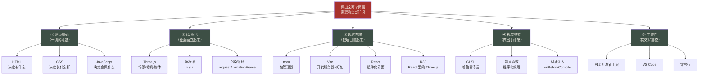
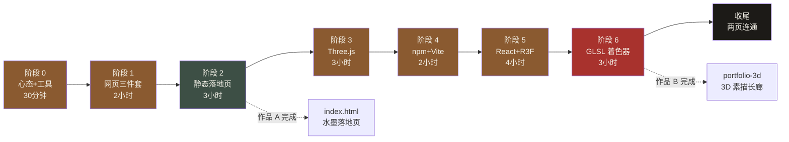
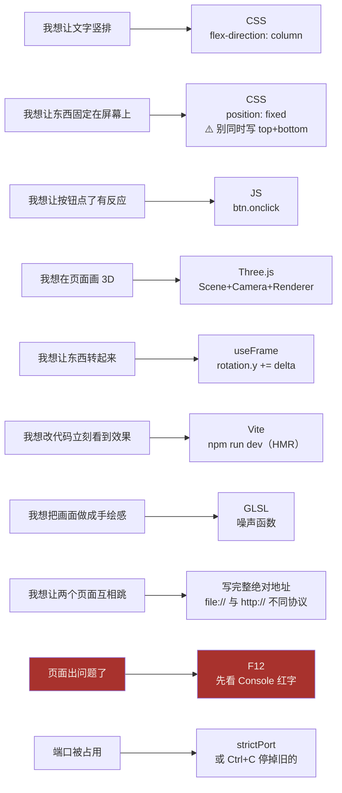
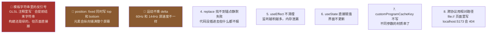

# 知识点思维导图

> 用图和树把「做出这两个页面」需要的知识整理清楚。
> 想快速回顾全局时看这份；想深入某个点，去 `02-知识点总图与通俗比喻.md`。

---

## 一、总览：一张图看清全部



---

## 二、学习路径：先后顺序不能乱



**为什么要按这个顺序？**

```
HTML/CSS/JS ──┬─→ 静态页 ──→ Three.js ──→ npm/Vite ──→ React/R3F ──→ GLSL
              │                              ↑
              └──────────────────────────────┘
                    每一层都建立在前一层上
```

**不能跳的原因**：

- 不会 HTML/CSS，看不懂 React 里的 JSX
- 不会 JS，看不懂任何逻辑代码
- 不会 Three.js 基础，看不懂 R3F 的 `<mesh>`
- 不会 npm/Vite，跑不起 portfolio-3d
- 不会 React，看不懂 R3F 的组件

---

## 三、树状图：每个知识点的位置

```
做出这两个页面
│
├── ① 网页基础（地基层）
│   ├── HTML —— 决定「有什么」
│   │   ├── 标签结构 <h1> <p> <div> <a>
│   │   ├── 属性 class / id / href / src
│   │   ├── head 与 body 的分工
│   │   └── <canvas> —— 3D 画面的画布
│   │
│   ├── CSS —— 决定「长什么样」
│   │   ├── 选择器：标签 / .class / #id
│   │   ├── 盒模型：margin / border / padding
│   │   ├── Flexbox 布局 ★
│   │   ├── 定位：position: fixed / absolute ★
│   │   ├── CSS 变量 :root { --xuan: ... } ★
│   │   ├── 过渡与动画 transition / animation
│   │   └── 字体回退链 font-family: "A", "B", serif
│   │
│   └── JavaScript —— 决定「会做什么」
│       ├── 变量 var / let / const
│       ├── 函数 function
│       ├── 事件 btn.onclick = function() {}
│       ├── DOM 操作 document.getElementById() ★
│       ├── 调试 console.log() ★
│       └── 时间 new Date() / setTimeout
│
├── ② 3D 图形（立体层）
│   ├── Three.js 三大件
│   │   ├── Scene 场景 —— 片场
│   │   ├── Camera 相机 —— 摄影机
│   │   └── Renderer 渲染器 —— 摄影师
│   │
│   ├── 物体三要素
│   │   ├── Mesh —— 演员（= Geometry + Material）
│   │   ├── Geometry 几何体 —— 身材（Box/Plane/Sphere）
│   │   └── Material 材质 —— 衣服（Basic/Standard）
│   │
│   ├── 坐标系 xyz
│   │   ├── x 左右 / y 上下 / z 前后 ★
│   │   └── 旋转用弧度 Math.PI / 2 = 90° ★
│   │
│   ├── 渲染循环
│   │   └── requestAnimationFrame —— 每秒 60 帧 ★
│   │
│   └── 进阶技巧
│       ├── 分段循环 —— 做无限走廊 ★
│       └── 对象池 —— 复用不新建
│
├── ③ 现代前端（工程层）
│   ├── npm —— 包管理器
│   │   ├── package.json —— 项目身份证
│   │   ├── npm install —— 装依赖
│   │   └── npm run dev —— 跑脚本
│   │
│   ├── Vite —— 开发服务器 + 打包工具 ★
│   │   ├── 实时翻译 .jsx / .scss
│   │   ├── HMR 热模块替换 —— 改代码不刷新 ★
│   │   ├── localhost:5173 —— 本地服务器 ★
│   │   └── strictPort —— 端口被占就报错 ★
│   │
│   ├── React —— 组件化界面
│   │   ├── 组件 —— 乐高积木 ★
│   │   ├── props —— 点菜（外部传入，只读）★
│   │   ├── state —— 白板（useState）★
│   │   ├── useEffect —— 入住/退房 ★
│   │   ├── useRef —— 抓对象（不触发重渲染）★
│   │   └── JSX —— class 要写 className ★
│   │
│   └── R3F（React Three Fiber）
│       ├── <Canvas> —— 3D 的容器 ★
│       ├── <mesh> = new THREE.Mesh() ★
│       ├── useFrame —— 每帧执行，运动要乘 delta ★
│       └── useContextBridge —— Canvas 里 context 会断 ★
│
├── ④ 视觉特效（灵魂层）
│   ├── GLSL 着色器
│   │   ├── 顶点着色器 —— 顶点位置（骨架）
│   │   ├── 片元着色器 —— 像素颜色（皮肤）★
│   │   ├── 数据类型 vec2/vec3/vec4 ★
│   │   ├── 小数必须写 1.0 不能写 1 ★
│   │   └── smoothstep / mix —— 平滑过渡 ★
│   │
│   ├── 噪声函数
│   │   ├── hash —— 打散成伪随机
│   │   ├── value noise —— 格子+平滑插值 ★
│   │   ├── fbm 多层叠加 —— 大尺度+小细节 ★
│   │   └── 噪声 vs 纯随机 —— 揉皱的纸 vs 撒沙子 ★
│   │
│   └── 材质注入
│       ├── onBeforeCompile —— 改 Three.js 内置着色器 ★
│       ├── #include <xxx> —— 插槽（chunk）
│       ├── customProgramCacheKey —— 缓存键，不写会串 ★
│       ├── uniform vs needsUpdate —— 便宜 vs 昂贵 ★
│       └── ⚠️ 模板字符串里不能有反引号 ★★★
│
└── ⑤ 工具链（效率层）
    ├── F12 开发者工具 ★★★
    │   ├── Console —— 看报错（永远第一步）
    │   ├── Elements —— 看结构/调样式
    │   └── Network —— 看加载
    ├── VS Code
    │   ├── 打开文件夹
    │   ├── 扩展：中文包
    │   └── Ctrl+S 保存 / Ctrl+F 查找
    └── 命令行
        ├── cd /d 路径 —— 进入文件夹（跨盘要 /d）★
        ├── dir —— 看有什么
        ├── npm install / npm run dev
        └── Ctrl+C —— 停止当前程序 ★
```

★ = 高频使用，务必掌握
★★★ = 踩过大坑，尤其要注意

---

## 四、两个项目的技术对照

| 技术点 | 作品 A（`index.html`） | 作品 B（`portfolio-3d`） |
|---|---|---|
| **文件形态** | 单文件，双击可开 | 多文件工程，需构建 |
| **协议** | `file://` | `http://localhost:5173` |
| **HTML** | 直接写标签 | 写成 JSX（React 组件） |
| **CSS** | 一个 `style.css` | 多个 `.scss`，按组件分 |
| **JS** | 传统 `<script>` + 全局函数 | ES Module + React 组件 |
| **Three.js 引入** | `<script src="three.min.js">`（UMD 版） | `import * as THREE from 'three'`（模块版） |
| **3D 代码组织** | 一个 `ink-world.js`（622 行） | 拆成 8 个组件 + 2 个 hook |
| **状态管理** | 全局变量 | React Context |
| **动画** | 手写 `requestAnimationFrame` | R3F 的 `useFrame` |
| **构建工具** | 不需要 | Vite |
| **依赖管理** | 手工下 JS 文件 | npm + `package.json` |
| **适合场景** | 小型页面、快速原型 | 中大型项目、团队协作 |

**核心差异一句话**：

> 作品 A 是**手工作坊**——什么都是自己敲，简单直接。
> 作品 B 是**工厂流水线**——有分工、有规范、有工具，适合做出复杂的东西。

**什么时候该用哪个？**

- 一个页面、几十行 JS → **作品 A 的写法**
- 上百个文件、多人协作、要长期维护 → **作品 B 的写法**

---

## 五、按「你想做什么」找知识



---

## 六、最容易踩的 8 个坑（按坑的深浅排序）



**每个坑的详细解释和修法，见 `01-新手实操手册.md` 对应章节，或 `02-知识点总图与通俗比喻.md` 的「避坑」部分。**

---

## 七、术语中英对照速查

| 中文 | 英文 | 一句话 |
|---|---|---|
| 标签 | tag | HTML 的基本单位 `<h1>` |
| 属性 | attribute | 标签上的附加信息 `class="x"` |
| 选择器 | selector | CSS 里指定"管哪些元素" |
| 盒模型 | box model | 内容+内边距+边框+外边距 |
| 弹性布局 | Flexbox | 自动排位子的布局方式 |
| 定位 | position | 决定元素怎么摆（fixed/absolute） |
| 变量 | variable | 带标签的盒子 |
| 函数 | function | 写好放着、需要时才执行 |
| 事件 | event | 用户操作触发的响应 |
| 场景 | Scene | 3D 的片场 |
| 相机 | Camera | 决定从哪看 |
| 几何体 | Geometry | 形状 |
| 材质 | Material | 表面长什么样 |
| 渲染 | render | 把数据算成一张图 |
| 帧 | frame | 一张画面 |
| 帧率 | FPS | 每秒画几张 |
| 着色器 | shader | 决定像素颜色的程序 |
| 片元 | fragment | 一个像素的候选着色单元 |
| 顶点 | vertex | 物体的角点 |
| 噪声 | noise | 可控的随机 |
| 统一变量 | uniform | 从 JS 传进着色器的值 |
| 组件 | component | 可复用的界面块 |
| 属性（React） | props | 外部传给组件的参数 |
| 状态 | state | 组件自己的可变数据 |
| 副作用 | side effect | 渲染之外要做的事 |
| 钩子 | hook | React 提供的特殊函数（useXxx） |
| 打包 | bundle | 把多个文件合成少数几个 |
| 构建 | build | 编译+压缩+优化的过程 |
| 热更新 | HMR | 改代码不刷新页面 |
| 依赖 | dependency | 项目用到的外部库 |
| 端口 | port | 一栋楼里的房间号 |
| 控制台 | console | 看报错的地方 |

---

## 八、一页速记（如果只记得住一件事）

```
HTML  管「有什么」   →  毛坯墙
CSS   管「长什么样」 →  装修
JS    管「会做什么」 →  水电煤气

Scene/Camera/Renderer  →  片场/摄影机/摄影师
Mesh = Geometry + Material  →  演员 = 身材 + 衣服

npm   管下载依赖
Vite  管开发时翻译 + 上线时打包

React 组件 = 乐高积木
React state = 白板（改了要重新渲染）
React ref = 钩子（改了不重渲染）

GLSL 片元着色器 = 每个像素涂什么色
噪声 = 揉皱的纸（相邻相关）
纯随机 = 撒一把沙子（相邻无关）

出问题 → F12 → Console 看红字
```

---

*配套材料：`01-新手实操手册.md`（教材）、`02-知识点总图与通俗比喻.md`（字典）、`04-速查卡.md`（便利贴）、`05-学习资源地图.md`（书单）*
